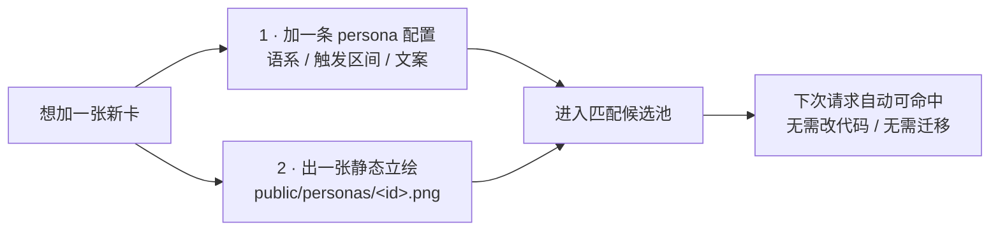
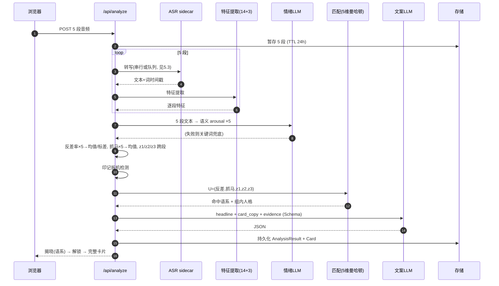
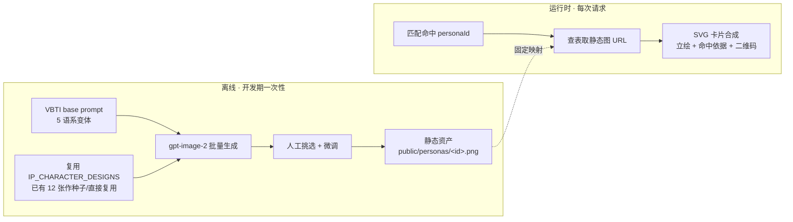
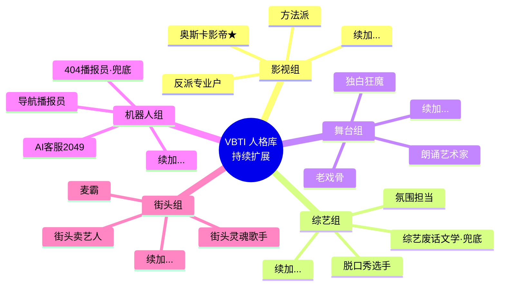
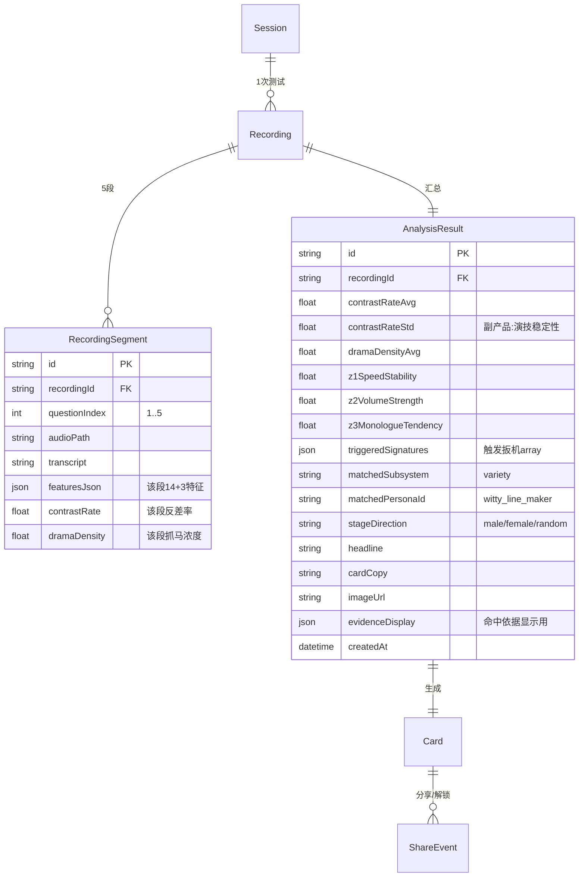

# VBTI 声音照妖镜 · 落地版 PRD (v1.1)

> **一句话定位**：说 60 秒话，VBTI 用**反差率**和**抓马浓度**两个可测声学指标，把你钉在一张"演艺人格卡"上——**你不是没在演，只是没意识到自己演得像谁。**

| 项目 | 内容 |
|---|---|
| 项目名 | **VBTI** (Voice-BS Type Indicator) · 中文别名 **声音照妖镜** |
| 文档版本 | **v1.1（落地版）** |
| 状态 | 与真实代码进度对齐，待队内评审 |
| 前身 | EchoID v0.2（PRD.md）→ TwoYin 的 VBTI v1.0（PRD-VBTI.md）→ **本版做工程对齐与降险** |
| 形态 | Web 网页应用（移动端优先） |
| 调性 | 社交娱乐 · 声学证据判决 · 分享裂变 |
| 场景 | 黑客松 MVP → SBTI 类病毒传播 |

> **本版为什么存在**：VBTI v1.0 的产品立意是对的，但开头「技术基座零改动·全部保留」与真实代码**不符**——被列为"✅ 保留"的 gpt-image-2、真实 LLM、Resend 登录**在代码里都还是 0**；而"反差率"依赖的 LLM 情绪抽取属于**净新增基础设施**。此外反差率的"声学 valence"、缺失特征、魔法阈值、5 段短片段噪声等细节没有对齐。本版基于对 `src/` 代码的逐文件核对重写，作为**开发唯一依据**。

---

## 0. 真实进度基线（对照 v1.0「✅ 保留」清单的逐条核实）

> 结论：真正能直接复用的是 **录音 UI + ASR + 14 声学特征 + 分享/二维码/落地页**。被 v1.0 误标为"保留"的三项其实未开工，且其中真实 LLM 是反差率的**前置依赖**。

### 0.1 已经真实可用（可直接复用）

| 模块 | 代码位置 | 状态 |
|---|---|---|
| Next.js 14 App Router + TS + Tailwind | `src/app/**` | ✅ 骨架完整 |
| 录音采集：MediaRecorder + 实时波形 + 倒计时 | `src/app/record/page.tsx` | ✅ 单题可跑 |
| ASR：faster-whisper `small` int8 CPU sidecar（含词级时间戳） | `services/asr/app.py`、`src/lib/providers/asr-fasterwhisper.ts` | ✅ 真实 |
| 14 声学特征管线（YIN F0 / Meyda RMS / energy VAD） | `src/lib/features/{extract,pitch,rms,vad,text,decode}.ts` | ✅ 真实 |
| Provider 抽象接口（ASR / LLM / Image） | `src/types/core.ts`、`src/lib/providers/index.ts` | ✅ 接口在 |
| 分享落地页 + 二维码卡片合成 | `src/app/s/[cardId]`、`src/app/api/share`、`src/app/api/card`、`qrcode` | ✅ 真实 |
| 音频 TTL 清理 | `src/app/api/cleanup`、`src/lib/storage.ts` | ✅ 真实 |

### 0.2 被 v1.0 标为"✅ 保留"、实则未开工（净新增）

| 模块 | v1.0 声称 | 真实状态 | 对 VBTI 的影响 |
|---|---|---|---|
| **真实 LLM Provider** | ✅ 可切换实现 | ❌ 仅 `llm-mock.ts`，`index.ts` 无真实分支 | 🔴 **阻塞**：反差率的语义情绪抽取必须靠它 |
| **gpt-image-2 意象图** | ✅ 保留 | ❌ 仅 `image-mock.ts`（纯 SVG 小人，从未接图像 API） | 🟠 v1 可用 SVG 模板替代 |
| **Resend OTP 登录 / User 账号** | ✅ 保留 | ❌ Prisma 无 User/Session 表；`session.ts` 只有匿名 cookie；无 Resend | 🟢 非 v1 关键路径，延后 |

### 0.3 当前能跑、但 VBTI 要整体替换的

| 模块 | 代码位置 | 处置 |
|---|---|---|
| 6 维打分（思维节奏/情绪外显度/…） | `src/lib/scoring/dimensions.ts`、`baselines.ts` | ♻️ 复用归一化工具，替换打分逻辑 |
| 12 角色库 + 加权欧氏匹配 | `src/lib/roles/{library,match}.ts` | ♻️ 换成开放卡池 + 曼哈顿两步匹配 |
| 6 维雷达卡片 + 单题录音 UI | `src/components/FullCard.tsx`、`record/page.tsx`、`result/**` | ♻️ 换成象限图 + 命中依据 + 5 段流程 |

### 0.4 复用率速览

```
可直接白嫖：  录音壳 · ASR · 14特征管线 · 分享/二维码/落地页 · TTL清理  ≈ 40%
需扩展改造：  特征(+3) · 打分→反差/抓马 · 匹配→开放卡池 · 录音1题→5题 · 数据模型  ≈ 45%
净新增：      真实LLM · (可选)gpt-image-2 · (延后)Resend登录             ≈ 15%
```

---

## 1. 产品概述

### 1.1 核心价值主张
VBTI 让用户第一次**通过声学证据**看到自己"演"的痕迹：
- **戳破**：你嘴上说得多平静 vs 声音里有多激动，差多远？（反差率）
- **定性**：你说话有多戏剧化？（抓马浓度）
- **归类**：你的声纹属于哪个"演艺角色"类型？（人格卡）

### 1.2 传播机制（为什么会火）
VBTI = SBTI 的"声学升级版"，与 MBTI/SBTI **三件套并存不替代**：

| 传播钩子 | 说明 |
|---|---|
| 反差率数字截图 | "我 82% 反差率" 自带话题，是"我 ENFP"的同类语料 |
| 象限图对比 | 两张卡叠一起对比落点，朋友圈/小红书易传播 |
| 印记扳机公开 | "系统听出我'声音在飙、内容却很淡'"——可解释 = 二创话题 |
| 稀缺/兜底款 | 稀缺款炫耀、兜底款自嘲，都会主动晒 |

### 1.3 非目标（Out of Scope）
- 不做 MBTI 心理评测、不给性格标签
- 不做发音矫正、口才培训
- 不评判"演戏"好坏（卡片中性或正向包装）
- v1 不做双人对比、不做实时 AI 对话
- **v1 不承诺 valence（正负情绪）反差**——见 §2.1 技术说明

---

## 2. 核心模型（修正版）

> v1.0 的两轴思路保留，但**反差率的定义做了关键修正**，并把两个未实现的特征补进管线。改动都标注了原因。

### 2.1 轴 1 · 反差率 Contrast Rate（**修正定义**）

> **✅ D1 已定案（采纳纯 arousal 方案）**：反差率放弃 valence，只做激动度反差。下面保留了取舍理由，方便后来人知道为什么这么定。

#### 🔴 v1.0 的问题
v1.0 定义：`反差率 = 语义情绪向量(valence, arousal) 与 声学情绪向量(valence, arousal) 的曼哈顿距离`，其中"声学 valence = F0_mean偏移 + RMS + pitch_slope + 语速稳定度"。

**这在语音情感识别里是伪命题**：声学信号能可靠反映 **arousal（激动/平静）**，但**测不出 valence（正面/负面）**——同样的高音量高音调，可能是狂喜也可能是暴怒。拿一个本身不可靠的"声学 valence"去和语义 valence 求差，得到的反差率**大部分是噪声**。而"不玄学、有声学证据"恰恰是 VBTI 对标 SBTI 的唯一立命之本。

#### ✅ v1.1 修正定义
**反差率 = 语义激动度 与 声学激动度 之差**（单轴 arousal 反差，去掉 valence）：

```
V_sem_arousal   = LLM 从 ASR 文本抽取的"内容激动程度" ∈ [0,1]
V_ac_arousal    = normalize( F0_std·w1 + RMS_dr·w2 + SR·w3 + SR_var·w4 + peak_density·w5 )  ∈ [0,1]
反差率 Contrast = | V_sem_arousal − V_ac_arousal | × 100   ∈ [0,100]
```

**产品话术不变，反而更利落**：
- 高反差 = "你嘴上云淡风轻，声音却在飙"（内容平静 + 声音激动）
- 或 = "你说得声嘶力竭，遣词其实很克制"（内容激烈 + 声音平静）
- 低反差 = "表里如一，怎么想就怎么说"

> **为什么这样更好**：声学 arousal 可靠可测；语义 arousal LLM 也擅长判断（"主角死了我要杀了编剧" vs "还行吧就那样"）。两个都可信，它们的差才是**真信号**，卡片才敢印"命中依据"。valence 反差列入 v2，届时可引入面部/多模态辅助。

#### 解读表（话术保留 v1.0）
| 反差率 | 档位 | 卡片话术 |
|---|---|---|
| 0-20% | 表里如一 | 你嘴上什么样，声音就什么样 — **本色型** |
| 21-40% | 略微伪装 | 有点掩饰但露馅 — **常人型** |
| 41-60% | 明显表演 | 开始进入角色了 — **老练型** |
| 61-80% | 严重反差 | 声音出卖了你 — **戏精型** |
| 81-100% | 完全分裂 | 声音在拆穿你 — **奥斯卡级** |

### 2.2 轴 2 · 抓马浓度 Drama Density（公式保留，补齐特征）

```
抓马浓度 = normalize( F0_std × 0.35 + RMS_dr × 0.35 + peak_density × 0.30 ) × 100
```
- `F0_std`、`RMS_dr`：✅ 现有 `extract.ts` 已产出。
- `peak_density`（每秒声学峰值数）：❌ **当前不存在，需新增**（见 §3.1）。

解读表沿用 v1.0（播报腔 / 常温型 / 说书型 / 综艺型 / 顶流型）。

### 2.3 三条辅轴 z1/z2/z3（幕后分化用）
| 辅轴 | 计算 | 现状 |
|---|---|---|
| z1 = 语速稳定性 | `1 − normalize(SR_var)` | ✅ SR_var 已有 |
| z2 = 音量强度 | `normalize(RMS_mean − baseline)` | ✅ RMS_mean 已有 |
| z3 = 独白倾向 | `normalize(sent_len × 停顿规律度)` | ⚠️ 停顿规律度**需新增**（见 §3.1） |

---

## 3. 特征管线扩展（在现有 `extract.ts` 上增量，不重写）

### 3.1 需新增的 3 个特征

| 特征 | 定义 | 实现要点 | 服务于 |
|---|---|---|---|
| **peak_density** | 每秒 F0/RMS 局部极值数（次/秒） | 在已算好的 `rms[]`/`f0[]` 帧序列上做局部极大值检测（滑窗 + 最小间隔去抖），除以时长 | 抓马浓度、综艺组印记 |
| **停顿规律度 pause_regularity** | 停顿间隔的规律程度 ∈ [0,1] | 取 VAD 已产出的 `pauses[]`，算相邻停顿间隔的变异系数 CV，`规律度 = 1 − clip(CV)` | z3 独白倾向、朗诵/舞台组印记 |
| **急停急启 burst_stops** | "N 秒内急停急启次数"（综艺组招牌信号） | 短窗内 RMS 由高→静→高的切换次数，直接复用 VAD 的 speech/silence 边界计数 | §4 卡片命中依据展示 |

> **硬约束**：凡是卡片上要印给用户看的"命中依据"（如"5 秒 3 次急停急启"），**必须有对应特征真实计算**。不允许出现"卡片印了但代码没算"的情况——那正好变成 VBTI 要反对的"玄学"。

### 3.2 5 段短片段的噪声问题（**必须处理**）

> `baselines.ts` 注释明确写着基线按 **"~30–60s 片段"** 校准。VBTI 把录音切成 **5 段 × 10–14s**，短片段会带来：TTR 虚高（趋近 1.0）、sent_len 常仅 1 句、SR_var/F0_std 样本不足 → 特征抖动 → 匹配不稳定，直接违反"同录音 3 次差异 <5%"。

**处理策略**：
1. **特征按"稳健程度"分两类使用**：
   - **稳健（逐段算可信）**：F0_mean/std、RMS_mean/dr、SR、peak_density → 逐段计算。
   - **脆弱（短段不可信）**：TTR、sent_len、SR_var → **优先在 5 段合并后的整段上计算**，或做跨段聚合，避免单段噪声。
2. **反差率/抓马浓度**：逐段算 → 取**均值**为主指标，**标准差**作为副产品（"演技稳定性"）。
3. **z1/z2/z3**：跨 5 段聚合计算，不用单段值。
4. 新增一份 **`baselines.segment.ts`（短片段基线）**，与整段基线分开，用冷启动测试音频标定。

### 3.3 第 4 题是关键枢纽（保留 v1.0 洞察）
前 3 题（防守型）压出反差率；**第 4 题（破防吐槽/情绪释放）是抓马浓度的唯一激活点**——没有它，综艺/街头/舞台组的高抓马卡永远匹配不到。第 5 题（剧本演 3 角色）验证 z1/z3。此结构予以保留。

---

## 4. 匹配算法（阈值全部配置化）

> 保留 v1.0 的"两步匹配：先定语系、再定人格"。但**所有魔法阈值抽到一份配置文件**，因为冷启动阶段这些数会反复调，硬编码会拖死校准。

### 4.1 卡池是可增长的开放集合，不是固定数字

**先说清楚定位**：卡池不锁死在 15 张或 35 张。它是一个**可以一直往里加卡的开放集合**——上线后按埋点补人格、按节日出限定卡、按社群反馈加梗卡，都不需要改算法、不需要改表结构。所以下面提到的数字都是"当前里程碑"，不是设计上限。

**起步规模建议：每语系 2 常规 + 1 特殊 = 15 张。** 理由是产能，不是架构：35 张卡意味着 35 份文案 + 35 版 image prompt + 35 套阈值，v1.0 里全标着"Q3 待打磨"。黑客松 48–72h 内做满 35 张且每张都能稳定命中，不现实。先做 15 张跑通"两步匹配 + 命中依据"闭环，再持续加。

这样规划的好处是**每一版都是完整可用的**：15 张能 Demo，加到 22 张也能 Demo，加到 35、50 张还是能 Demo。加卡是平滑的，不存在"必须一次做满 N 张"的坎。

### 4.2 第一步 · 定语系：5 维曼哈顿 + 印记扳机

```
用户向量 U = (反差率, 抓马浓度, z1, z2, z3) ∈ [0,100]⁵

for 语系 i in [影视, 综艺, 舞台, 机器人, 街头]:
    距离_i = ManhattanDistance(U, 中心_i) / max_dist        ∈ [0,1]
    得分_i = 1 - 距离_i
    if 触发(印记_i):  得分_i += SIGNATURE_BONUS   // 默认 0.30，配置化
命中语系 = argmax(得分_i)
```

语系中心坐标与印记扳机条件沿用 v1.0 §3.4，但**全部放进 `src/lib/matching/config.ts`**：

```ts
// 示意：所有中心 / 阈值 / 权重集中于此，校准时只改这里
export const SUBSYSTEM_CENTERS = {
  film:    { x:75, y:55, z1:60, z2:55, z3:50 },
  variety: { x:55, y:90, z1:20, z2:65, z3:30 },
  stage:   { x:25, y:80, z1:90, z2:65, z3:95 },
  robot:   { x:40, y:10, z1:90, z2:50, z3:50 },
  street:  { x:20, y:95, z1:25, z2:95, z3:20 },
} as const;

export const SIGNATURE_TRIGGERS = { /* 每语系印记的阈值表达式 */ };
export const SIGNATURE_BONUS = 0.30;
```

> 5 个语系是二维象限的自然骨架，相对稳定；**扩展主要发生在语系内部的人格数量上**（也不排除未来加第 6 语系，但那属于大版本）。

### 4.3 第二步 · 定人格：语系内分化
决策顺序保留 v1.0：**稀缺款阈值 → 兜底款阈值 → 常规款取最近邻**。每张卡的触发区间放进配置。常规款走最近邻这一点很关键：**新加一张常规卡，只是往候选池里多丢一个中心点**，最近邻自然就会在合适的声学区间命中它，不用动匹配逻辑。

### 4.4 卡池怎么加卡（可扩展性设计）

加一张新卡是一次**纯数据操作**，不碰算法、不碰数据库结构：



落地要求（写给实现的约束）：
- 人格库是**数据驱动**的（一个 `personas.ts` 数组或 JSON），不是散落在代码里的 if-else。
- `matchedPersonaId` 在 `AnalysisResult` 里就是个字符串，加卡不改 schema。
- 立绘按 `personaId` 约定命名，前端按 id 取图，加图不改前端。
- "卡池位置：你是 XX 组第 N 张"里的 N 和总数**从卡池长度动态算**，别写死。

这条设计让"持续加卡"变成可运营的动作：产品/运营加配置、设计出图，工程零介入。

### 4.5 兜底与保底（Demo 稳定性）
- **404 播报员**（机器人组兜底）绑定"无效音频/长静音/极低音量"——`extract.ts` 已能判低 RMS，直接接。
- **Demo 保底策略**：现场用 3–5 条预录音频保证 100% 命中已知语系（沿用 v1.0 §12），预录音频清单见 §10 D5。

---

## 4A. 题目结构与文案（5 道情境题 · Phase 3 依据）

> 从 v1.0 §4 收录进来，让本文档自包含。文案是 v1 稿，可再打磨；但**题型结构（防守 3 题 + 释放 1 题 + 剧本 1 题）不要动**，它直接决定各语系扳机能不能被激活。

### 4A.1 五题总览（合计 60s）

| # | 场景 | 时长 | 类型 | 主激活维度 |
|---|---|---|---|---|
| 1 | 老板问升职 | 12s | 职场高压防守 | 反差率（机器人组扳机） |
| 2 | 相亲问单身 | 12s | 亲密尴尬防守 | 反差率 |
| 3 | 同事甩锅 | 10s | 愤怒克制 | 反差率（影视组扳机） |
| 4 | 追剧塌房吐槽 | 12s | 情绪释放 | **抓马浓度**（综艺/街头/舞台组扳机） |
| 5 | 剧本演 3 角色 | 14s | 主动扮演 | 全维度 + z1/z2/z3 验证 |

结构原理：前 3 题用高压情境逼用户"演"，把反差率拉开；第 4 题是抓马浓度的**唯一激活点**（没它，高抓马语系永远匹配不到）；第 5 题主动切角色，验证 z1 稳定性 / z3 独白倾向 / 变声能力。

### 4A.2 题目文案（v1 稿）

1. **述职汇报**（12s）— 老板开完会叫住你："你说说，你觉得为什么这个季度没轮到你升职？" 你怎么回？
2. **相亲局**（12s）— 相亲对象皱着眉："你这个人怎么单这么久了？" 你怎么回？
3. **甩锅时刻**（10s）— 项目出事，同事当着老板的面指着你："这块是他/她负责的"——可根本不是你负责的。你怎么回？
4. **破防现场**（12s）— 你追了 3 年的剧完结了，主角死了。对着闺蜜/兄弟发一条 12 秒语音，骂编剧。
5. **戏路选择 → 剧本演 3 角色**（14s）— 见 §4A.3。

每题前 0.8–1.2s 显示场景卡（电影分幕效果），盖住 ASR/DSP 延迟，进度条显示"第 X / 5 题"，单题失败可只重录当前题。

### 4A.3 第 5 题：戏路选择 + 3 组台词

先给一张戏路选择卡（男主视角 / 女主视角 / 抽盲盒），再按选择渲染 3 句台词，每句一种情绪 tone：

| 戏路 | 严厉 tone | 柔情 tone | 不羁 tone |
|---|---|---|---|
| 男主视角 | 严厉老板："这方案不行，重做" | 温柔女友："你回来啦，我给你留了饭" | 叛逆少年："我不想上学了，怎么样" |
| 女主视角 | 严厉老板："这方案不行，重做" | 温柔男友："我在家等你呢，别赶" | 叛逆少女："这鬼学校我不想去了，咋" |
| 抽盲盒 | 从上两组随机拼装，可能出现"严厉教练/严厉妈妈"等变体 | | |

设计要点，直接影响实现边界：
- 三组 preset 的**算法输入完全等价**，只有柔情角色性别相反。**声学分析层零改动**，前端只多一张选择卡。
- 跨性别演绎（男演女友/女演男友）是核爽点，天然拉高反差率。
- 只问"戏路"不问"性别"：避开性别政治，非二元/跨性别用户可 opt-in 到盲盒；"剧场词汇"强化表演宇宙沉浸感。

---

## 5. 技术架构

### 5.1 技术栈现状（诚实版）

| 层 | 技术 | 真实状态 |
|---|---|---|
| 前端 | Next.js 14 + TS + Tailwind | ✅ 有 |
| 录音 | Web Audio + MediaRecorder | ✅ 有（单题，需改 5 段） |
| ASR | faster-whisper small int8 sidecar | ✅ 有 |
| 声学 DSP | ffmpeg + YIN + Meyda + VAD | ✅ 有（需 +3 特征） |
| **情绪抽取 LLM** | 从 ASR 文本抽 arousal | ❌ **净新增**（当前仅 mock） |
| 匹配 | 5 维曼哈顿 + 印记扳机 | ❌ 替换现有 6 维欧氏 |
| 卡片合成 | **SVG**（非 @vercel/og）+ qrcode | ⚠️ 现实是 SVG：`@vercel/og` 因缺中文字体未启用，`share/route.ts` 直接拼 1080×1350 SVG |
| 意象图 | gpt-image-2 **静态资产** | 🟡 已有产线：`IP_CHARACTER_DESIGNS/` 存了 12 张跑通的 low-poly 立绘 + 可复用 base prompt。策略见 §5.5，不再是"SVG mock" |
| 数据 | Prisma + SQLite | ✅ 有（schema 需扩展） |
| 登录 | Resend OTP | ❌ 无 User 表，延后 |

> **注意**：v1.0 说卡片合成用 `@vercel/og` 输出 PNG，**实际代码因中文字体问题改用了 SVG**（见 `share/route.ts` 注释）。VBTI 卡片继续走 SVG 路线即可，无需引 og。

### 5.2 分析管线时序（5 段版）



### 5.3 ⚠️ 并发瓶颈（v1.0 未提，必须处理）
`services/asr/app.py` 是**单个 `_model` 实例**。5 段音频：
- **串行**：whisper-small int8 CPU 每段约 2–4s × 5 = **10–20s**，超 v1.0 承诺的 <8s。
- **并发打同一模型**：CPU 抢占，未必更快，还可能 OOM。

**建议**：
1. v1 先接受"ASR 阶段 ~10–15s"的现实，把它**包进揭晓动画**（沿用 EchoID 揭晓设计，等待即体验）。把 §9 的 <8s 目标放宽到 **DSP+匹配 <3s、含 ASR 端到端 <20s**。
2. 若要压时间：sidecar 加**请求队列 + 2 worker**，或改用 `faster-whisper` 的 batched 接口一次喂 5 段。列为 v1.5 优化。
3. DSP（纯 JS，CPU 轻）可安全并行 5 段。

### 5.4 情绪抽取 LLM 调用（新增 Provider）
新增 `src/lib/providers/llm-<vendor>.ts`，实现现有 `LLMProvider` 接口，`index.ts` 增加分支。两类调用：
- **情绪抽取**（新方法）：输入 ASR 文本 → 输出 `{ arousal: 0..1, reasoning }`，Schema 约束。
- **卡片文案**（沿用 `generateProfile`）：输出 headline / card_copy / evidence / image_prompt。

失败/超时/schema 违规 → **fallback 到本地关键词打分**（激动词表：骂/死/绝了/笑死/离谱…），保证管线不断。

### 5.5 意象图与 IP 形象策略（gpt-image-2 静态资产）

> **✅ D2 定案：v1 走"离线预生成的静态人格立绘"，不做逐请求实时生图。**
> 之前 v1.1 草稿建议"先用 SVG，生图留 v1.5"，那是在我以为生图还没跑通的前提下写的。看到 `IP_CHARACTER_DESIGNS/` 里 12 张成品后，结论反过来了。真正值钱的不是那 12 张图，是背后那条跑通的产线：low-poly faceted 画风、大头小身、4:5 结果卡构图、单道具、柔和渐变背景，外加一份能复用的 base prompt。丢掉它去画 SVG 才是浪费。

**为什么静态预生成，而不是实时生图**

对一个固定人格库的测试类产品，实时逐用户生图是负担，不是卖点：
- MBTI/SBTI 的病毒性靠的就是一组固定、可辨认、可收集的角色。人格立绘做成固定的，反而更贴这个传播机制。
- 现场 Demo 最怕联网生图：慢、要花钱、还可能失败。预生成的静态图零延迟、零 API 依赖、稳。
- 起步一批（约 15 张）一次性离线画完，之后每加一张卡补一张图，之后运行时只是查表取图。

逐用户个性化生图（按戏路/反差率微调立绘）是真正的锦上添花，放 v2。

**离线产线（一次性，不进请求链路）**



请求链路里没有生图这一步，`ImageProvider` 退化成"按 personaId 返回静态 URL"，`image-mock.ts` 的 SVG 小人只当兜底占位。**每加一张卡就离线补一张图**（对应 §4.4 的加卡流程），不影响已上线的图。

**当前人格库（起步 15 张，可持续扩展）**

下图是起步阵容，不是终态。每个语系内都能继续往下加常规卡，稀缺/兜底也能再补：



**已有 12 张的复用映射**

12 张原本是给 EchoID 的"贴金型"角色画的，画风能整套继承，但角色语义得重新对位。有几张几乎能直接改名用，多数要按 VBTI 的"照妖镜/戏剧化"调性重画：

| 已有资产 | 视觉锚点 | → VBTI 人格 | 复用度 |
|---|---|---|---|
| `07_standup_performer` | 舞台姿势 + 闪光话筒 + 聚光灯 | 综艺组·脱口秀选手 | ♻️ 直接复用（几乎 1:1） |
| `06_poet_reader` | 长发 + 诗集 + 纸叶 | 舞台组·朗诵艺术家 | ♻️ 直接复用（几乎 1:1） |
| `10_deep_philosopher` | 眼镜 + 灯泡 + 书廊 | 舞台组·独白狂魔 | ♻️ 改造（换独白/戏剧张力） |
| `05_steady_decision_maker` | 抱臂 + 眼镜 + 公文包 | 影视组·方法派 | ♻️ 改造（加"入戏"感） |
| `04_neighbor_chatter` | 挥手 + 茶杯 + 门廊 | 综艺组·氛围担当 | ♻️ 改造 |
| `08_boardroom_speaker` | 讲台 + 演示手势 | 机器人组·AI客服2049 | ♻️ 改造（加机械/客服元素） |
| `11_cheerleader` | 头带 + 彩球 + 彩纸 | 街头组·麦霸 | ♻️ 改造（换街头/音响） |
| `12_calm_narrator` / `01_late_night_radio_host` | 卷轴叙述 / 耳机复古麦 | 机器人组·导航播报员 | ♻️ 改造（播报腔） |
| — | — | 影视组·反派专业户、奥斯卡影帝；机器人组·404 播报员；街头组·灵魂歌手、卖艺人 | 🆕 新生成（约 6–7 张） |
| `03_gentle_hollow` / `09_curious_asker` / `02_rapid_lecturer` | — | 起步阵容暂不对位，留作后续扩池的现成素材 | ⏸️ 暂存 |

起步这 15 张里，约 8 张能从已有资产改出来，6–7 张新生成。之后每加一张卡补一张图，工作量摊平在运营里，不占开发主链路。

**VBTI base prompt（在 README 那版上加"戏剧化"框架）**

原 base prompt 的画风参数照抄，只加两件事：语系统一氛围、人格专属道具。示意：

```text
沿用 EchoID low-poly 立绘规范：stylized 3D low-poly，大头小身，
3/4 正面全身，faceted 服装，简化友好脸，哑光材质，干净剪影，4:5 结果卡构图。

VBTI 语系氛围（5 选 1）：
  影视组 = 片场/胶片光；综艺组 = 综艺舞台+彩色灯带；
  舞台组 = 剧场追光+幕布；机器人组 = 冷色数据网格；街头组 = 夜市霓虹。

人格道具（每卡 1 件）：如脱口秀选手=立麦+聚光、朗诵艺术家=诗集+纸叶、
  AI客服2049=耳麦+对话气泡、麦霸=手持麦+音响。

Avoid：copying existing MBTI avatars、text、logo、watermark、写实人脸、
  动漫风、杂乱背景、过多配饰。
```

> 收敛技巧：5 个语系各定一句氛围锚点，同语系内只换道具和配色，保证一眼能看出"这是综艺组的"，人格之间又有区分。

---

## 6. 数据模型（相对现状的 Delta）

现状 `AnalysisResult` 是 6 维单录音结构。VBTI 需要 5 段 + 新指标。



**迁移要点**：
- 新增 `RecordingSegment` 表（1 录音 5 段）。
- `AnalysisResult` 用**新字段**替换 `dimensionsJson/matchedRoleId`（保留 `featuresJson` 存整段聚合特征）。
- `Recording` 去掉单 `audioPath`（移到 segment），或保留为"合并整段"路径。
- Prisma 迁移：`prisma db push`（dev SQLite，无历史数据包袱）。
- 现有 `Card`/`ShareEvent` 结构**基本不动**，`share/route.ts` 里把硬编码的"你说话像 + ROLE_LIBRARY 查表"改成"语系·人格 + 反差率数字"。

---

## 7. 分阶段开发路线（与真实进度对齐）

> 排序原则：**先证伪核心指标，再铺产品**。反差率若不成立，后面全白搭——所以 Phase 0 是一切的前置。

### Phase 0 · 反差率可行性 Spike（半天，最高优先级）🔴
- 录 8–10 条真人音频（覆盖"平静内容/激动嗓音"、"激烈内容/平静嗓音"等反差极端）。
- 手工跑：真实 LLM 抽语义 arousal vs 声学 arousal（用现有 `extract.ts` 的 F0_std/RMS_dr/SR）。
- **判据**：反差率数值能否拉开分布、同条音频 3 次是否稳定（<5%）。
- **不通过就停**：回退到"抓马浓度单轴"产品（只做戏剧化程度，不做反差），或引入多模态。
- 产出：`scripts/contrast_spike.ts` + 一页结论。

### Phase 1 · 补齐被误标为"已有"的基础设施（1 天）
- [ ] 真实 LLM Provider（`llm-openai.ts` 或 `llm-claude.ts`）+ `index.ts` 分支 + Schema + 关键词兜底。
- [ ] 情绪抽取方法（文本 → arousal）。
- [ ] `ImageProvider` 改为"按 personaId 查静态图"（D2 已定，见 §5.5），SVG mock 仅作兜底。

### Phase 1.5 · 离线出图（并行，不占开发主链路）
- [ ] 按 §5.5 base prompt 生成起步 15 张人格立绘，能改的从已有 12 张改；之后按加卡节奏增量补图。
- [ ] 落到 `public/personas/<id>.png` + 一张 `personaId → 图` 映射表。
- [ ] 谁来跑：有 gpt-image-2 key 的同学，Phase 0 通过后即可开工，和 Phase 2-4 并行。

### Phase 2 · 特征管线扩展（1 天，在 `extract.ts` 增量）
- [ ] `peak_density`（局部极值检测）
- [ ] `pause_regularity`（停顿间隔 CV）
- [ ] `burst_stops`（急停急启计数）
- [ ] `baselines.segment.ts`（短片段基线）
- [ ] 单测：`features/__tests__` 加 3 个特征的 smoke（仿现有 `extract.smoke.ts`）

### Phase 3 · 5 段录音改造（1.5 天，唯一大结构改动）
- [ ] `record/page.tsx`：单题 → 5 场景卡 + 进度条 + 单题重录 + 戏路选择卡
- [ ] `record/topics.ts` → `scenarios.ts`：5 道情境题文案 + 第 5 题 3 组 preset 台词（文案见 §4A）
- [ ] `/api/analyze`：单 blob → 5 blob（数组上传，逐段处理）
- [ ] Prisma：加 `RecordingSegment`、扩 `AnalysisResult`、`db push`

### Phase 4 · 匹配层替换（1 天）
- [ ] `matching/config.ts`：语系中心 + 印记扳机 + 卡池阈值（配置化）
- [ ] `matching/subsystem.ts`：5 维曼哈顿 + 印记扳机 argmax
- [ ] `matching/persona.ts`：语系内稀缺→兜底→常规分化
- [ ] `roles/library.ts` → `personas.ts`：**数据驱动的开放卡池**（起步 15 张，加卡只加数据）+ 文案 + image_prompt 模板
- [ ] 替换 `pipeline.ts` 里 `scoreDimensions/matchRole` 调用

### Phase 5 · 结果 UI（1 天）
- [ ] `FullCard.tsx`：6 维雷达 → **2D 象限图**（SVG，5 语系分区着色 + 你的落点）
- [ ] 主视觉换成命中人格的静态立绘（`public/personas/<id>.png`，Phase 1.5 产出）
- [ ] **命中依据区**：反差率/抓马数值 + 档位标签 + 触发扳机 + 人话解释
- [ ] 卡池位置："你是 XX 组第 N 张"
- [ ] 揭晓页 `ResultReveal.tsx`：只显示语系名 → 解锁看人格（二次悬念，逻辑已在）
- [ ] `share/route.ts`：卡片文案改语系·人格 + 反差率数字

### Phase 6 · 冷启动校准 + Demo 保底（0.5 天）
- [ ] 用 §10 D5 的预录音频跑分布，手调 `config.ts` 阈值
- [ ] 3–5 条保底音频固定命中已知语系

**关键路径合计 ≈ 6.5 人日**（Phase 0 通过的前提下）。Phase 1.5 离线出图不占关键路径，交给有 gpt-image-2 key 的同学并行跑。其余并行：Phase 1（LLM）与 Phase 2（特征）两人并行；Phase 3（前端 5 段）与 Phase 4（匹配）并行。

---

## 8. 非功能需求（按现实修订）

| 指标 | v1.0 目标 | v1.1 修订 | 说明 |
|---|---|---|---|
| DSP + 匹配 | 含 ASR <8s | **DSP+匹配 <3s** | 纯 JS，可并行 |
| 端到端（录完 → 出卡片） | <45s | **<20s**（立绘是静态资产，链路无生图） | 主要耗时在 ASR |
| ASR 5 段 | 未提 | **~10–15s，包进揭晓动画** | 单模型串行现实 |
| 完成率 题1→题5 | >65% | >60% | 5 题偏长，保守 |
| 同录音 3 次差异 | <5% | <5%（反差/抓马） | **依赖 §3.2 短段降噪落实** |
| 兼容性 | 移动端主流 | 同 | 微信内置浏览器 getUserMedia 为已知风险 |

---

## 9. 风险与待确认（合并 v1.0 + 新增工程风险）

| # | 风险 | 影响 | 应对 |
|---|---|---|---|
| **R0** 🔴 | **反差率核心指标不成立**（arousal 反差拉不开/不稳） | 产品立论塌 | **Phase 0 spike 先证伪**；不过则退化为纯抓马浓度产品 |
| **R1** | 微信内浏览器 getUserMedia 限制 | 无法录音 | 检测环境，引导"用浏览器打开"（EchoID 已知） |
| **R2** | 5 段短片段特征噪声 | 匹配抖动、违反 <5% | §3.2 稳健/脆弱特征分治 + 双基线 |
| **R3** 🟠 | **ASR 单模型 5 段串行超时** | 端到端慢 | §5.3 包进揭晓动画 / v1.5 队列化 |
| **R4** | 阈值冷启动偏差、5 语系分布不均 | 舞台/街头/机器人组变废 | 阈值配置化 + 印记扳机 +30% + 埋点校准 |
| **R5** | 情绪抽取 LLM 漂移 | arousal 输出不稳 | Schema 约束 + 重试 + 关键词兜底 |
| **R6** | 卡池一次性做太多、Demo 前做不完 | Demo 做不完 | **开放卡池 + 起步 15 张**（§4.1）；产能允许就随时加，做不完不影响已有卡可用 |
| **R7** | 卡片"命中依据"太技术，用户看不懂 | Aha 失效 | 每信号配一句人话翻译 |
| **R8** | ~~gpt-image-2 成本/延迟~~ 已解 | — | **D2 已定：静态预生成**，请求链路无生图，成本/延迟风险消除 |

---

## 10. 待决策点（每条附建议；D1/D2 已拍板）

| # | 决策 | 选项 | **结论** |
|---|---|---|---|
| **D1** ✅ | 反差率是否放弃 valence、改纯 arousal 反差 | A. 纯 arousal / B. 双维 valence+arousal | **已定 A**：声学 valence 不可靠，是核心风险源；话术不受损（见 §2.1） |
| **D2** ✅ | v1 意象图方案 | A. SVG 小人 / B. gpt-image-2 静态预生成 / C. 逐请求实时生图 | **已定 B**：已有产线 + 12 张成品，离线预生成静态立绘，零延迟零 API 依赖（见 §5.5） |
| **D3** 🟢 | 卡池起步规模 | 开放卡池，起步张数自定（建议 15） | **改为运营节奏，不是二选一**：卡池设计成可持续加卡（§4.4），起步先做够 Demo 的量（约 15），之后按产能补 |
| **D4** | Resend 登录是否进 v1 | A. 延后 / B. 进 v1 | **建议 A**：匿名 session 已够 Demo，账号是 v1.5 |
| **D5** | 冷启动测试音频谁录、何时录 | — | 开发第 1 天团队各录 4–5 条，覆盖 5 语系极端样本 |
| **D6** | LLM 供应商 | OpenAI / Claude / 国内 | 按现有 key 与合规定；Provider 抽象已支持切换 |

---

## 11. 验收标准（可测、去循环论证）

- [ ] **Phase 0 通过**：反差率在 8–10 条真人音频上分布拉开（极差 >40），同条 3 次差异 <5%
- [ ] 5 题连续录制在移动端可完成，单题失败可重录，全程无无反馈卡顿
- [ ] 反差率 & 抓马浓度：同录音 3 次分析差异 <5%
- [ ] 卡片"命中依据"区显示的**每个信号都有对应真实特征**（无"印了没算"）
- [ ] 兜底款正确触发：无效音频/静音 → 404 播报员
- [ ] 戏路选择"男/女/盲盒"三选项工作，第 5 题台词正确切换
- [ ] 揭晓页只给语系名，解锁后才显示人格（二次悬念）
- [ ] 分享图含二维码，微信扫码跳转 `/s/[cardId]`
- [ ] 原始音频 TTL 24h 后自动删除（`cleanup` 可验证）
- [ ] 象限图正确渲染 5 语系分区 + 用户落点
- [ ] **可解释性抽检**：随机 3 张结果卡，人工核对命中依据数值与后端特征一致

> **注**：v1.0 的"5 语系各 20% ±5%"改为**监控指标而非验收硬标准**——冷启动手设阈值下无法保证均匀分布，强行验收会变成"自己挑样本自证"。均匀性上线后按真实埋点校准。

---

## 12. 三人分工与分支协作

### 12.1 分工原则
按"纵切"而非"横切"分：每人拿一条从数据到产出相对完整的链路，让各自改动的目录**基本不重叠**，减少合并冲突。三条线的交界只有两处，需要先对齐（见 §12.4）。

### 12.2 三人职责与主战场

| 成员 | 模块 | 主要目录（改动集中区） | 负责的 Phase |
|---|---|---|---|
| **A · 声学 / 算法** | 特征扩展 + 反差率/抓马 + 匹配 | `lib/features/` `lib/scoring/` `lib/matching/` `lib/roles→personas` | Phase 0（主）、2、4、6 |
| **B · 前端 / 交互** | 5 段录音 + 结果 UI + 象限图 | `app/record/` `app/result/` `components/` `app/s/` | Phase 3、5 |
| **C · 后端 / 数据 / 集成** | LLM Provider + 数据模型 + pipeline + 分享 + 离线出图 | `lib/providers/` `prisma/` `lib/pipeline.ts` `app/api/` `public/personas/` | Phase 1、1.5、（3 的 API 部分） |

分工依据：A 全程在 `lib/` 算法层，B 全程在 `app/`+`components/` 视图层，C 管 provider/DB/API 胶水层和离线资产。三人日常提交几乎不碰同一个文件。

### 12.3 分支模型：一模块一分支 → 稳定后合 master

```mermaid
gitGraph
    commit id: "master (PRD)"
    branch feat/acoustic-algo
    branch feat/record-ui
    branch feat/backend-integration
    checkout feat/acoustic-algo
    commit id: "Phase0 spike"
    commit id: "特征+匹配"
    checkout feat/record-ui
    commit id: "5段录音"
    commit id: "结果UI"
    checkout feat/backend-integration
    commit id: "LLM+数据模型"
    checkout master
    merge feat/acoustic-algo tag: "算法稳定"
    merge feat/backend-integration tag: "后端稳定"
    merge feat/record-ui tag: "前端稳定"
```

分支命名：
- `feat/acoustic-algo`（A）
- `feat/record-ui`（B）
- `feat/backend-integration`（C）

规则：
- 每人在自己分支开发，**功能稳定（本模块自测通过）才合 master**。
- 合并前先 `git pull origin master` 并把 master 合进自己分支解冲突，再 PR，避免把冲突丢给别人。
- master 保持随时可 Demo；未稳定的功能不合。
- 合并走 PR + 另一人 review（三人互审，谁空谁审）。

### 12.4 两处必须先对齐的交界（否则三线会打架）

这两件事**在各自开工前，三人一起定，先合一个小 PR 进 master**：

1. **类型契约 `src/types/core.ts`** —— 这是三条线的接口边界。要一起改的：
   - `AcousticFeatures` 加 3 个新字段（peak_density / pause_regularity / burst_stops）。
   - 新增 `ContrastResult`（反差/抓马/z1-3/triggered）、`Persona`、VBTI 版 `AnalysisProfile`。
   - 删/换掉 6 维的 `Dimension`/`DIMENSION_KEYS`。
   - **定好这个文件，A/B/C 就能各写各的**：A 产出这些类型、C 存这些类型、B 渲染这些类型。

2. **`/api/analyze` 的请求/响应契约** —— B（前端上传 5 段）和 C（后端处理）的边界。先约定：5 段 multipart 字段名、`stageDirection` 怎么传、部分揭晓/完整卡片两个响应的 JSON 形状。

> 建议：第 1 天三人先合力把 §12.4 这两个契约 PR 进 master，之后三条分支才真正并行。这半天投入省下后面一堆合并冲突。

### 12.5 里程碑节奏（建议）

| 阶段 | 全员 | 产出 |
|---|---|---|
| Day 0 | 合力定 §12.4 契约 + A 跑 Phase 0 | 契约进 master；反差率可行性结论 |
| Day 1–2 | 三线并行开发 | 各分支功能自测通过 |
| Day 2–3 | 依次合并（算法→后端→前端）+ 联调 + Phase 6 校准 | master 可 Demo |

> Phase 0 若不通过（反差率拉不开），Day 0 当天就要开会决定退化方案（纯抓马浓度产品），不要带着未验证的核心指标往下做。

---

## 附录 · 与 v1.0（PRD-VBTI.md）的差异摘要

| 主题 | v1.0 | v1.1（本版） |
|---|---|---|
| 技术基座定位 | "零改动全保留" | 逐条核实：白嫖40%/改造45%/**净新增15%** |
| 反差率 | 语义 vs 声学 **valence+arousal** | **纯 arousal 反差**（去伪信号） |
| 缺失特征 | 未提 | 明列 peak_density/停顿规律度/急停急启 **待建** |
| 短片段噪声 | 未提 | §3.2 稳健/脆弱分治 + 双基线 |
| LLM/生图/登录 | 标"✅保留" | 标**净新增/延后**，给替代方案 |
| 意象图 | gpt-image-2 逐请求生图 | **静态预生成**，复用 `IP_CHARACTER_DESIGNS/` 产线（§5.5） |
| 卡片合成 | @vercel/og PNG | 更正为 **SVG**（现实） |
| ASR 并发 | 未提 | §5.3 单模型瓶颈 + 应对 |
| 阈值 | 硬编码在文档 | **配置化** `matching/config.ts` |
| 卡池 | 固定 35 张 | **开放卡池**，起步约 15 张，数据驱动可持续加卡（§4.1/§4.4） |
| 验收"20%均匀" | 硬标准 | 降为**监控指标** |
| 开发路线 | 一次性 v1 清单 | **Phase 0 先证伪** + 6 阶段与代码对齐 |

---

**文档结束 · v1.1 落地版**


