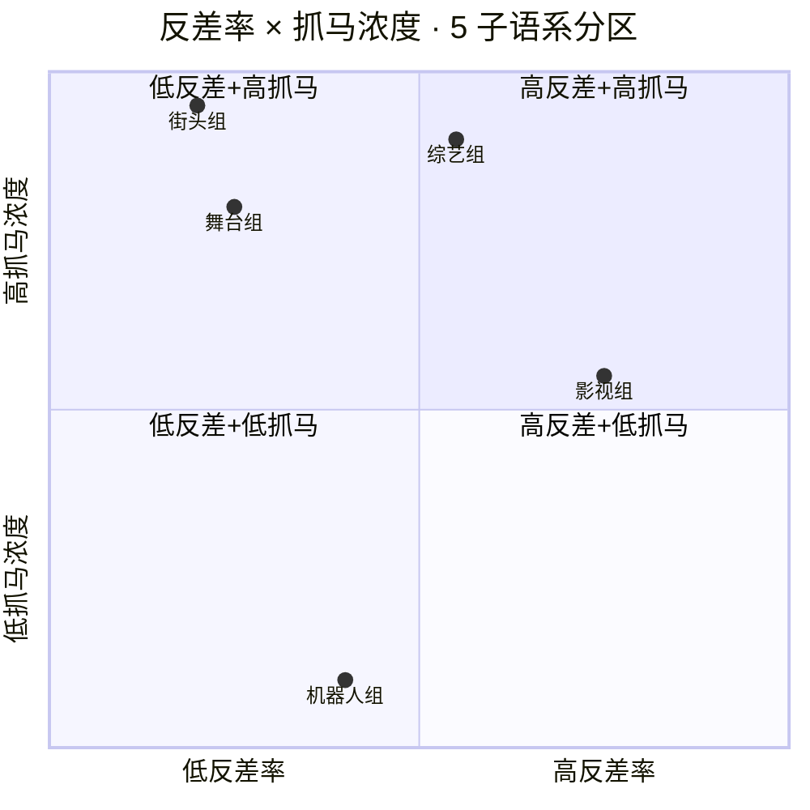
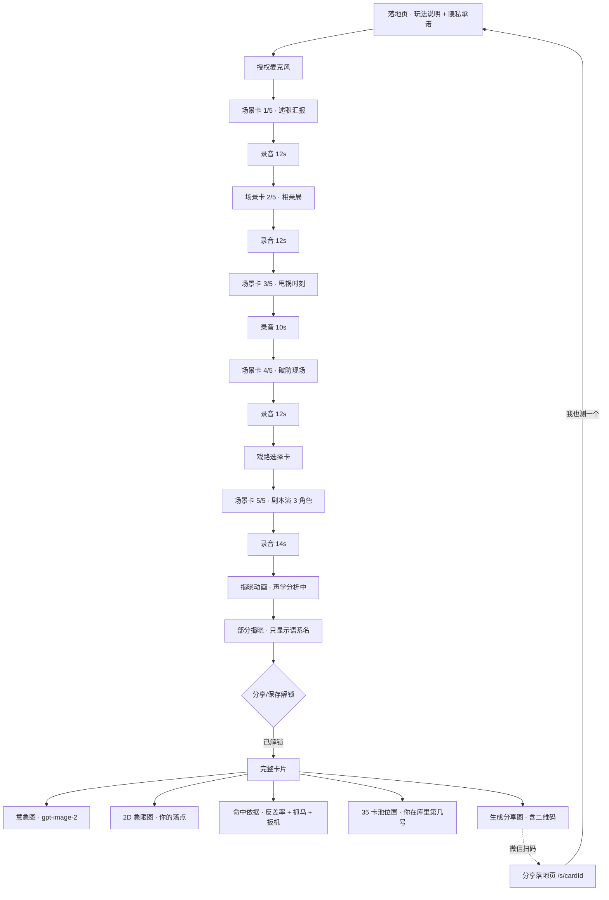
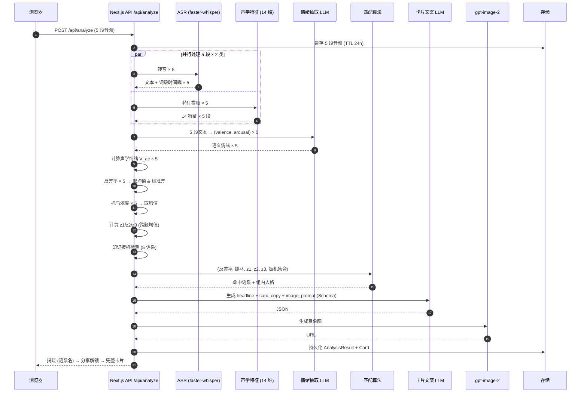
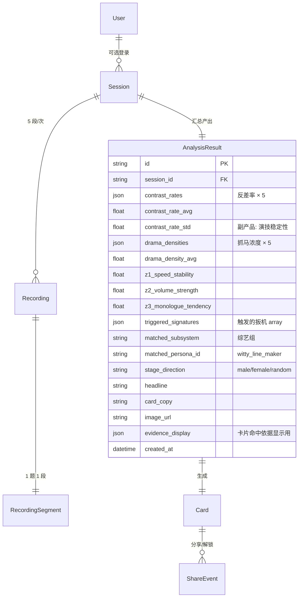
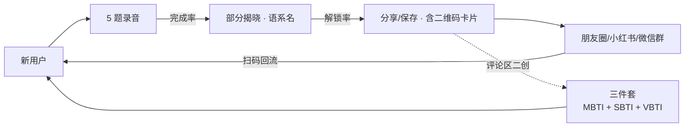

# VBTI 声音照妖镜 · 产品需求文档 (PRD)

> **一句话定位**: 说 60 秒话, VBTI 用**反差率**和**抓马浓度**两个声学指标把你钉在 35 张演艺人格卡的其中一张——**你不是没在演, 只是没意识到自己演得像谁。**

| 项目 | 内容 |
|---|---|
| 项目名 | **VBTI** (Voice-BS Type Indicator) · 中文别名 **声音照妖镜** |
| 文档版本 | v1.0 |
| 状态 | 需求已锁, 待评审 |
| 前身 | EchoID (v0.2) — 保留全部技术基座, 替换核心模型与题目 |
| 形态 | Web 网页应用 (移动端优先) |
| 调性 | 社交娱乐 · 声学证据判决 · 分享裂变 |
| 场景 | 黑客松 MVP → SBTI 类型病毒传播 |

---

## 0. 与 EchoID 的关系 (给队友的 Diff)

### 全部保留 (技术基座零改动)
- Next.js 14 App Router + TypeScript + Tailwind
- Prisma + SQLite (dev) / Postgres (prod)
- faster-whisper `small` int8 CPU (Python FastAPI sidecar) 做 ASR
- ffmpeg 音频解码 / 重采样
- YIN F0 提取 + Meyda RMS + energy VAD
- **14 声学特征抽取管线** (SR, SR_var, pause_count, F0_mean/std, RMS_mean/dr, pitch_slope_end, filler_rate, TTR, sent_len 等)
- Provider 抽象层 (ASR / LLM / Image, 可切换实现)
- gpt-image-2 意象图生成
- 分享落地页 `/s/[cardId]` + 二维码卡片合成
- Resend OTP 邮箱登录 (可选)
- 匿名 session 优先

### 替换 (核心模型 & 题目)
| EchoID (v0.2) | VBTI (v1.0) |
|---|---|
| ❌ 6 维打分 (思维节奏 / 情绪外显度 / 气场 / 决策模式 / 沟通风格 / 思维深度) | ✅ **2 主轴 + 3 辅轴** (反差率 / 抓马浓度 + z1/z2/z3) |
| ❌ 12 个"贴金型"角色 (深夜电台主持人 / 温柔树洞 / …) | ✅ **35 张"贴脸型"卡片** (5 语系 × 7 张 = 25 常规 + 5 兜底 + 5 稀缺) |
| ❌ 15 道开放日记题 (你的周末 / 你最近怎么样) | ✅ **5 道结构化情境题** (60s 总时长) |
| ❌ 6 维雷达图卡片 | ✅ **2D 象限图 + 命中依据** (可解释性透明化) |
| ❌ "你说话像 XX" 叙述定位 | ✅ **"照妖镜: 揭穿你在演什么"** 传播定位 |

### 为什么这么改
EchoID 的技术做对了两件事: **可测声学特征 + 可解释判定**。但产品层错了两处:

1. **题目错**: 日记题让用户处于叙述模式, 声学画像稳定, 25% 用户被匹到同一角色, 差异化崩塌
2. **人格库错**: 12 个正向描述给用户戴高帽, 没有 SBTI 那种"戳破/自嘲"的社交货币属性 — 没人愿意主动分享"我是深夜电台主持人"

VBTI 保留底层, 重构产品层:
- **表演宇宙** 定义人格库 — 演技隐喻天然贴合声学反差 mechanic
- **5 道结构化情境题** 强制用户进入表演状态, 让声学信号分化
- **反差率 + 抓马浓度** 两指标做匹配, 卡片自带"命中依据" — SBTI 是选择题算分玄学, VBTI 是声学证据判决

---

## 1. 产品概述

### 1.1 核心价值主张

VBTI 让用户第一次**通过声学证据**看到自己"演"的痕迹:

- **戳破**: 你嘴上说的 vs 你声音里的, 差多远?(反差率)
- **定性**: 你说话有多戏剧化?(抓马浓度)
- **归类**: 你的声纹属于哪个"演艺角色"类型?(35 张卡片)

### 1.2 传播机制 (为什么会火)

VBTI = SBTI 的"声学升级版", 三件套并存 (SBTI + VBTI + MBTI), 不替代:

| 传播钩子 | 说明 |
|---|---|
| **反差率数字截图** | "我 82% 反差率" 自带话题, 是"我 ENFP" 的同类语料 |
| **象限图对比** | 两个人的卡片叠一起对比落点, 视觉直观, 微博/朋友圈易传播 |
| **印记扳机公开** | "系统听出我'5 秒 3 次急停急启'" — 可解释性 = 二创话题 |
| **稀缺款炫耀** | 万分之一的"奥斯卡终身成就奖", 抽中即分享 |
| **兜底款自嘲** | "综艺废话文学" 类兜底款, 抽中会晒自嘲 |
| **跨性别演绎** | 男演女友、女演男友天然反差爆表, 卡片抓马值拉满 |

### 1.3 非目标 (Out of Scope)

- 不做 MBTI 心理评测, 不给性格标签
- 不做发音矫正、口才培训
- 不评判用户"演戏"是好是坏 (所有卡片中性或正向包装)
- 不做实时 AI 对话 (黑客松成本超限)
- v1 不做双人对比模式 (v2+)

---

## 2. 目标用户与传播场景

### 2.1 用户画像
- Z 世代 / 90 后 (18-32), 熟悉 SBTI/MBTI 变体测试
- 会主动截图分享朋友圈 / 小红书 / 微博 / 微信群
- 手机端优先, PC 端可用

### 2.2 传播场景
- 小红书 SBTI 帖子评论区: "咱把 VBTI 也一起晒了" — 三件套身份叠加
- 朋友圈九宫格 or 单张截图: 反差率数字自带话题
- 微信群互相测: "你们试试, 我抽到 XX"
- 抖音/小红书笔记: 结果卡片 + 15 秒吐槽二创

---

## 3. 核心模型

### 3.1 两大可视化轴

#### 轴 1 · 反差率 Contrast Rate

**定义**: 语义情绪向量 与 声学情绪向量 的曼哈顿距离, 归一化到 0-100%。

**语义情绪向量 V_semantic** (来自 ASR + LLM):
- ASR 转写 → LLM 抽 (valence, arousal)
- valence: -1 (负面) ~ +1 (正面)
- arousal: 0 (平静) ~ 1 (激动)

**声学情绪向量 V_acoustic** (来自 14 声学特征):
- valence 声学信号 = F0_mean 相对基线偏移 + RMS_mean + pitch_slope_end + 语速稳定度
- arousal 声学信号 = F0_std + RMS_dr + SR + SR_var

**距离**: Manhattan distance, 归一化到 [0, 100]。

**解读表** (卡片文案基础):
| 反差率 | 档位 | 卡片话术 |
|---|---|---|
| 0-20% | 表里如一 | 你嘴上什么样, 声音就什么样 — **本色型** |
| 21-40% | 略微伪装 | 有点掩饰但露馅 — **常人型** |
| 41-60% | 明显表演 | 开始进入角色了 — **老练型** |
| 61-80% | 严重反差 | 嘴上一套心里一套 — **戏精型** |
| 81-100% | 完全分裂 | 声音在拆穿你 — **奥斯卡级** |

**爽点**: 戳破。用户看到自己"言不由衷"的科学证据。

#### 轴 2 · 抓马浓度 Drama Density

**定义**: 声学"戏剧化"信号强度。

**公式**:
```
抓马浓度 = normalize(F0_std × 0.35 + RMS_dr × 0.35 + peak_density × 0.30)
```
其中 `peak_density` = 每秒声学峰值数 (F0 或 RMS 局部极值)。

**解读表**:
| 抓马 | 档位 | 卡片话术 |
|---|---|---|
| 0-20% | 冷静叙述 | 说啥都像念公告 — **播报腔** |
| 21-40% | 日常表达 | 有点情绪但不外露 — **常温型** |
| 41-60% | 有起伏 | 说得挺带劲 — **说书型** |
| 61-80% | 抓马 | 情绪管理已下线 — **综艺型** |
| 81-100% | 抓马本马 | 自带背景音乐 — **顶流型** |

**爽点**: 定性。用户看到自己"演的是什么类型"。

### 3.2 象限图 (给用户看的可视化)



用户看 2D 图, 算法用 5D 判定 (见 §3.4)。

### 3.3 5 子语系人格库 (35 张卡片)

**元主题**: 「都在演, VBTI 告诉你演的是啥」

每语系约 5 常规款 + 1 兜底款 + 1 稀缺款 = 7 张 × 5 语系 = **35 张**。

#### 影视组 (反差率主导, 中抓马)
| # | 卡片名 | 类型 | 触发描述 |
|---|---|---|---|
| 1 | 群演 | 常规 | 反差 60-70 + 抓马 45-60 + 无特殊信号 |
| 2 | 方法派 | 常规 | 反差 70-85 + 抓马 50-65 + z1 (语速稳定) 高 |
| 3 | 反派专业户 | 常规 | 反差 70-85 + 抓马 55-70 + F0_mean 低 |
| 4 | 替身演员 | 常规 | 反差 65-75 + z1 中等 |
| 5 | 奥斯卡影帝 | 常规最强 | 反差 80-90 + 抓马 55-70 |
| 6 | NG 王 | 兜底 | filler_rate > 4/min (吃词严重) |
| 7 | 奥斯卡终身成就奖 | 稀缺 | 反差 > 90 |

#### 综艺组 (抓马主导, 中反差)
| # | 卡片名 | 类型 | 触发描述 |
|---|---|---|---|
| 1 | 抢麦怪 | 常规 | 反差 30-60 + 抓马 60-80 + SR > 7 字/s |
| 2 | 脱口秀选手 | 常规 | 反差 55-80 + 抓马 65-85 |
| 3 | 氛围担当 | 常规 | 反差 30-55 + 抓马 78-92 |
| 4 | 金句制造机 | 常规 | 反差 75-90 + 抓马 78-92 |
| 5 | 综艺小霸王 | 常规 | 反差 45-70 + 抓马 70-88 + 峰值密度高 |
| 6 | 综艺废话文学 | 兜底 | 抓马 40-60 + filler_rate > 3/min |
| 7 | 总决赛冠军 | 稀缺 | 反差 > 90 + 抓马 > 90 + z1 > 80 |

#### 舞台组 (低反差, 高抓马, 长句独白)
| # | 卡片名 | 类型 | 触发描述 |
|---|---|---|---|
| 1 | 话剧腔 | 常规 | 反差 15-35 + 抓马 70-85 + z3 (独白倾向) 高 |
| 2 | 独白狂魔 | 常规 | 反差 20-40 + 抓马 75-90 + sent_len > 15字 |
| 3 | 朗诵艺术家 | 常规 | 抓马 70-85 + 停顿规律度极高 |
| 4 | 幕布后台 | 常规 | 反差 25-45 + 抓马 65-80 + RMS 稍低 |
| 5 | 老戏骨 | 常规 | 反差 30-45 + 抓马 75-90 + z1 > 75 |
| 6 | 忘词的 NG 王 | 兜底 | filler_rate > 4/min + 长句被打断 |
| 7 | 独白之神 | 稀缺 | sent_len > 25字 + 停顿规律度 > 90 + 抓马 > 85 |

#### 机器人组 (中反差, 超低抓马)
| # | 卡片名 | 类型 | 触发描述 |
|---|---|---|---|
| 1 | AI 客服 2049 | 常规 | 反差 30-50 + 抓马 < 25 + z1 高 |
| 2 | 导航播报员 | 常规 | 抓马 < 20 + 语速极稳 + F0_std < 20Hz |
| 3 | 天气预报员 | 常规 | 抓马 < 30 + pitch_slope_end 平坦 |
| 4 | 故障复读机 | 常规 | 抓马 < 20 + 语速一成不变 |
| 5 | 屏保 BGM | 常规 | 抓马 < 25 + RMS 稳定 |
| 6 | 404 播报员 | 兜底 | 无效音频 / 长时间静音 / 极低音量 |
| 7 | 图灵测试通过者 | 稀缺 | F0_std < 8Hz + filler_rate = 0 + z1 > 95 |

#### 街头组 (低反差, 超高抓马, 音量爆)
| # | 卡片名 | 类型 | 触发描述 |
|---|---|---|---|
| 1 | 街头灵魂歌手 | 常规 | 反差 15-35 + 抓马 80-90 + RMS 高 |
| 2 | 相声票友 | 常规 | 抓马 75-88 + SR_var > 0.6 |
| 3 | 街头卖艺人 | 常规 | 抓马 80-92 + F0_std 极大 |
| 4 | 广场舞担当 | 常规 | 抓马 78-90 + RMS_dr 极大 |
| 5 | 麦霸 | 常规 | 抓马 82-92 + RMS > baseline+6dB |
| 6 | 卖艺不卖身 | 兜底 | 抓马 40-60 + 音量极低 |
| 7 | 街头之王 | 稀缺 | RMS > baseline+10dB + 抓马 > 92 |

### 3.4 两步匹配算法

#### 第一步 · 定语系: 5 维中心距离 + 印记扳机

**5 维空间**:
| 维度 | 计算 | 用途 |
|---|---|---|
| x = 反差率 | Manhattan(V_sem, V_ac) | 卡片可视化 (主) |
| y = 抓马浓度 | 加权公式 | 卡片可视化 (主) |
| z1 = 语速稳定性 | 1 - normalize(SR_var) | 幕后分化 |
| z2 = 音量强度 | normalize(RMS_mean - baseline) | 幕后分化 |
| z3 = 独白倾向 | normalize(sent_len × 停顿规律度) | 幕后分化 |

**5 语系中心坐标 & 印记扳机**:

| 语系 | 中心 (x, y, z1, z2, z3) | 印记扳机 (触发时 +30% 权重) |
|---|---|---|
| 影视组 | (75, 55, 60, 55, 50) | 反差率 > 65 且 抓马 45-70 |
| 综艺组 | (55, 90, 20, 65, 30) | SR_var > 0.5 且 peak_density > 5/s |
| 舞台组 | (25, 80, 90, 65, **95**) | sent_len > 15字 且 F0_std > 40Hz |
| 机器人组 | (40, 10, 90, 50, 50) | F0_std < 15Hz 且 filler_rate < 0.3/min |
| 街头组 | (20, 95, 25, **95**, 20) | RMS_mean > baseline + 8dB |

**判定公式**:
```
用户向量 U = (反差率, 抓马浓度, z1, z2, z3)  ∈ [0,100]⁵

for each 语系 i in [影视, 综艺, 舞台, 机器人, 街头]:
    距离_i = ManhattanDistance(U, 中心_i) / max_dist   ∈ [0,1]
    得分_i = 1 - 距离_i
    if 用户触发 印记_i:
        得分_i += 0.30
    
命中语系 = argmax(得分_i)
```

**为什么用 Manhattan 而不是 Euclidean**:
- SBTI 用的就是 Manhattan Distance
- 语义: "5 维上各差多少格" 比"高维欧氏球面"更直觉
- 每维独立累加, 便于卡片解释

**为什么需要印记扳机**:
- 分布中心用户在多个语系间距离都很近, 匹配靠 tie-break, 极不稳定
- 印记扳机 = "独家一票否决权", 声学信号极端时该语系强抢命中
- 保证匹配结果稳定 + 可解释

#### 第二步 · 定人格: 语系内 7 卡分化

进入某语系后, 按更细的 (反差率, 抓马浓度, 专属信号) 分化到 7 张卡片。规则见 §3.3 各语系的触发描述列。

**决策顺序**:
1. 先检查 **稀缺款** 阈值 — 满足则命中
2. 否则检查 **兜底款** 阈值 — 满足则命中
3. 否则在 5 张常规款里取 Manhattan 距离最近的一张

### 3.5 卡片"命中依据"设计 (VBTI 独家爽点)

卡片下半屏必须显示可解释性区块:

```
━━━━━━━━━━━━━━━━━━━━━━━━━
   🎪 综艺组 · 金句制造机
━━━━━━━━━━━━━━━━━━━━━━━━━

  命中依据

  ✓ 反差率     82%  ── 嘴上圆场心里翻白眼
  ✓ 抓马浓度   87%  ── 说啥都自带 BGM

  🎯 印记扳机触发:
     「5 秒内经历 3 次急停急启」
     → 综艺组独家声纹指纹

  为什么是你, 一目了然。
━━━━━━━━━━━━━━━━━━━━━━━━━
```

**为什么这是杀器**:
- SBTI 是"选择题算分, 结果玄学"
- VBTI 是"声学证据判决, 过程透明"
- 用户 aha moment: **不只是抽到什么, 而是理解为什么被匹到**
- 黑客松评委加分点: 技术含量可见
- 二创话题: "我印记扳机是 XX, 你呢?"

---

## 4. 题目结构 (方案 β)

### 4.1 5 题总览

| # | 场景 | 时长 | 类型 | 主激活维度 |
|---|---|---|---|---|
| 1 | 老板问升职 | 12s | 职场高压防守 | 反差率 (机器人组扳机) |
| 2 | 相亲问单身 | 12s | 亲密尴尬防守 | 反差率 |
| 3 | 同事甩锅 | 10s | 愤怒克制 | 反差率 (影视组扳机) |
| 4 | 追剧塌房吐槽 | 12s | 情绪释放 | **抓马浓度** (综艺/街头/舞台组扳机) |
| 5 | 剧本演 3 角色 | 14s | 主动扮演 | 全维度验证 (z1/z2/z3) |
| **合计** | | **60s** | | |

### 4.2 结构设计原理

- **前 3 题防守型**: 高压情境让用户"演"起来, 反差率轴分化拉开
- **第 4 题释放型 (关键枢纽)**: 无面对面压力, 用户会真的骂/真的表演, 综艺/街头/舞台组的抓马扳机在此激活 — 没有它, 25 卡里 15 张永远匹配不到
- **第 5 题剧本题**: 主动切换角色, 直接测 z1 (稳定性) / z3 (独白倾向) / 变声能力, 是子语系印记的最终验证器

### 4.3 每题文案 (v1 稿, Q3 待打磨)

**题 1 · 场景卡「述职汇报」** (12s)
> 你的老板刚开完会, 叫住你:  
> "你说说, 你觉得为什么这个季度没轮到你升职?"
> 
> 你怎么回?

**题 2 · 场景卡「相亲局」** (12s)
> 相亲对象喝了一口咖啡, 皱着眉:  
> "你这个人怎么单这么久了?"
> 
> 你怎么回?

**题 3 · 场景卡「甩锅时刻」** (10s)
> 项目出了大事, 同事在会议室当着老板的面说:  
> "这块是他/她负责的" — 指着你,  
> 但根本不是你负责的。
> 
> 你怎么回?

**题 4 · 场景卡「破防现场」** (12s)
> 你追了 3 年的剧完结了, 主角死了。
> 
> 请对着闺蜜/兄弟发一条 12 秒语音, 骂编剧。

**题 5 · 场景卡「戏路选择 → 剧本演 3 角色」** (14s)

戏路选择卡 (0.8s 过渡):
```
━━━━━━━━━━━━━━━━━━━━━━━━━
     最后一题 · 挑一条戏路
━━━━━━━━━━━━━━━━━━━━━━━━━

  🎬  [ 男主视角 ]
      演: 严厉老板 · 温柔女友 · 叛逆少年

  🎬  [ 女主视角 ]  
      演: 严厉老板 · 温柔男友 · 叛逆少女

  🎲  [ 抽个盲盒 ]
      系统随机搭配
━━━━━━━━━━━━━━━━━━━━━━━━━
```

**3 组 preset 台词**:

| 戏路 | 严厉 tone | 柔情 tone | 不羁 tone |
|---|---|---|---|
| 男主视角 | 严厉老板<br/>"这方案不行, 重做" | 温柔女友<br/>"你回来啦, 我给你留了饭" | 叛逆少年<br/>"我不想上学了, 怎么样" |
| 女主视角 | 严厉老板<br/>"这方案不行, 重做" | 温柔男友<br/>"我在家等你呢, 别赶" | 叛逆少女<br/>"这鬼学校我不想去了, 咋" |
| 抽盲盒 | 从上述两组随机拼装, 也可能出现"严厉教练/严厉妈妈"等变体 | | |

**核心巧思**:
- 每 preset 保留 **3 种情绪 tone (严厉/柔情/不羁)**, 算法输入完全等价
- 只有"柔情角色"性别相反, 其他不变
- **声学分析层零改动**, 前端多 1 个选择卡而已
- 跨性别演绎是**核爽点** (男演女友、女演男友天然拉高反差率)

### 4.4 戏路选择的产品价值

不问"性别", 只问"戏路" — 避免二元强制:
- 避开性别政治雷区 (非二元/跨性别用户 opt-in 到"盲盒")
- 戏路 = 剧场词汇, 强化"表演宇宙"沉浸感
- 抽盲盒选项体现"不做二元强制"的价值观 — Demo 加分点

### 4.5 题目衔接与场景卡

每题前 0.8-1.2s 显示"场景卡片":
- 电影分幕效果, 盖住 ASR/DSP 延迟
- 统一格式: `场景 X / 5 · 【标题】`
- 进度条显示"你在第 X 题"
- 单题录音失败可"重录当前题"(不重来全部)

---

## 5. 端到端用户流程



### 关键 UX 点
- **5 题连续录制**, 不打断节奏, 进度条可见
- **揭晓页只给"语系"** (如"综艺组"), 隐藏具体人格 → 解锁后才看到"金句制造机" — 二次悬念
- **完整卡片包含**:
  1. 意象图 (gpt-image-2 生成, 主视觉)
  2. 象限图 (你的落点 + 5 语系分区)
  3. 命中依据 (反差率数值 + 抓马数值 + 触发的印记扳机 + 一句人话解释)
  4. 语系金句 (LLM 生成的定性描述)
  5. 35 卡池位置 (你是"综艺组第 4 张 / 影视组第 7 张")

---

## 6. 技术架构

### 6.1 技术栈总览

| 层 | 技术 | 来源 |
|---|---|---|
| 前端框架 | Next.js 14 App Router + TypeScript + Tailwind | ✅ EchoID 保留 |
| 音频采集 | Web Audio API + MediaRecorder | ✅ EchoID 保留 |
| ASR | faster-whisper `small` int8 CPU (Python FastAPI sidecar) | ✅ EchoID 保留 |
| 声学 DSP | ffmpeg + YIN F0 + Meyda RMS + energy VAD | ✅ EchoID 保留 |
| 情绪抽取 | LLM 从 ASR 文本抽 (valence, arousal) | 🆕 新增 |
| 匹配算法 | 5 维 Manhattan + 印记扳机 | 🆕 替换 6 维打分 |
| 卡片合成 | @vercel/og + qrcode | ✅ EchoID 保留 |
| 意象图 | gpt-image-2 (Image Provider 抽象) | ✅ EchoID 保留 |
| 数据 | Prisma + SQLite (dev) / Postgres (prod) | ✅ EchoID 保留 |
| 登录 | Resend OTP | ✅ EchoID 保留 |

### 6.2 匹配管线时序



### 6.3 情绪抽取 LLM 调用

给 LLM 的 Prompt Schema 约束:
```json
{
  "task": "从中文口语文本抽取二维情绪坐标",
  "input_text": "……用户 ASR 转写……",
  "output_schema": {
    "valence": "number, -1 (极负面) 到 +1 (极正面)",
    "arousal": "number, 0 (完全平静) 到 1 (极度激动)",
    "reasoning": "一句话解释"
  }
}
```
失败/超时/schema 违规 → fallback 到本地 sentiment 规则引擎 (基于关键词打分)。

### 6.4 数据流与隐私 (继承 EchoID)
- 5 段原始音频短期保留 (TTL ≤ 24h) 后自动删除
- 转写文本仅用于生成"金句引用", 可配置随音频过期
- 卡片 / 意象图 / 分析结果持久化 (分享需要)
- 授权前明确告知"录音用完即删"

---

## 7. 功能需求 FR (相对 EchoID 的 Delta)

### ✅ 完全保留
- FR-1 录音采集 (MediaRecorder)
- FR-2 上传后端 (multipart)
- FR-3 ASR 转写 + 14 声学特征
- FR-5 卡片合成 + 二维码
- FR-6 分享落地页
- FR-7 匿名 session + Resend OTP 登录

### 🆕 新增/替换

**FR-A · 5 题结构化录音流程 (替换 FR-1 单题)**
- 5 个场景卡按序显示, 每题结束自动进入下一题
- 每题独立音频 blob, 后端并行处理
- 进度条显示"第 X / 5 题"
- 支持"重录当前题"(不重来全部)

**FR-B · 戏路选择 (新增, 题 5 前 0.8s)**
- UI: 3 选项按钮 (男主/女主/盲盒)
- 选择本地存储, 影响题 5 台词渲染
- 盲盒: 从"男主/女主"两组随机, 或引入变体角色 (严厉教练/严厉妈妈)

**FR-C · 反差率算法 (新增)**
- 输入: 5 段 ASR 文本 + 14 声学特征 × 5
- 输出: 每题反差率 (0-100), 均值 (主指标) + 标准差 (副产品: 演技稳定性)

**FR-D · 抓马浓度算法 (新增)**
- 输入: F0_std, RMS_dr, peak_density (每题)
- 输出: 每题抓马浓度, 5 题均值

**FR-E · 印记扳机检测 (新增)**
- 5 语系逐一检测阈值
- 输出触发集合 (可能同时触发多个)

**FR-F · 5 维匹配 + 组内分化 (替换 EchoID 6 维打分 + 12 角色)**
- 第一步: argmax 命中语系
- 第二步: 稀缺 → 兜底 → 常规最近邻 顺序命中人格

**FR-G · 命中依据卡片区 (新增)**
- 显示反差率 + 抓马浓度数值 + 档位标签
- 显示触发的印记扳机 + 通俗解释
- 显示"你是 35 卡池的第 X 张"

**FR-H · 象限图卡片区 (新增)**
- 静态 SVG 象限图, 5 语系分区着色
- 你的落点用高亮圆点标记
- 可对比模式 (v2): 两个用户落点叠加

---

## 8. 数据模型 (相对 EchoID 的 Delta)

新增: 5 段录音 → 1 个分析结果, `AnalysisResult` 字段扩展。



---

## 9. 非功能需求

| 指标 | 目标 |
|---|---|
| **性能** · 5 题录完 → 出完整卡片 | < 45s (含生图) |
| **性能** · ASR + DSP + 匹配 | < 8s |
| **完成率** · 题 1 开始 → 题 5 完成 | > 65% (v1 目标) |
| **稳定性** · 同一录音多次分析差异 | < 5% (反差率 & 抓马浓度) |
| **兼容性** · 移动端浏览器 | Chrome / Safari / Firefox 主流版本 |
| **单成本** | 1 × 5-段 ASR + 1 × 情绪 LLM + 1 × 文案 LLM + 1 × gpt-image-2 |

---

## 10. 增长与埋点

### 北极星指标
- **分享率**: 生成卡片并主动分享或保存的比例 — 目标 > 40%

### 关键指标
| 指标 | 目标 | 用途 |
|---|---|---|
| 5 题完成率 | > 65% | 检测题目疲劳度 |
| 反差率分布 | 呈健康 U 形/正态 (均值 55±20) | 检测算法冷启动阈值 |
| 抓马浓度分布 | 呈正态 (均值 50±25) | 同上 |
| 5 语系命中比例 | 影视/综艺/舞台/机器人/街头 各 20% ±5% | 检测印记扳机是否有效分化 |
| 印记扳机触发率 | 每扳机 15-30% | 校准阈值用 |
| 稀缺款命中率 | < 2% (万分之一~百分之一) | 保证稀缺款的传播效应 |
| 兜底款命中率 | < 5% | 保证兜底不喧宾夺主 |
| 戏路选择分布 | 男/女/盲盒 各不为 0 | 检测戏路机制是否被使用 |
| 扫码回流率 | > 25% | 病毒传播健康度 |

### 裂变闭环


---

## 11. 风险与待确认

| # | 风险 | 影响 | 应对 |
|---|---|---|---|
| **R1** | 微信内浏览器 getUserMedia 限制 | 无法录音 | 检测环境, 引导"用浏览器打开" |
| **R2** | 5 题连续录音的移动端稳定性 | 后段崩溃 | 单段 blob 独立上传, 失败可重录该段 |
| **R3** | 反差率阈值冷启动偏差 | 用户集中在 40-60% 中值, 分化不足 | 团队预制 30-50 条测试音频, 现场手动标注校准 |
| **R4** | 5 语系分布不均 (影视/综艺组吃走 70% 用户) | 舞台/街头/机器人组变废 | 印记扳机 +30% 权重强制拉分, 上线后按埋点校准 |
| **R5** | 盲盒选项使用率低, 被质疑"多此一举" | Demo 扣分 | 主动展示"我们不做二元强制"的价值观加分 |
| **R6** | 剧本题 3 句台词角色跨度不够 | z1/z3 印记全部触发失败 | v1 前 A/B 测试 3 组台词版本 |
| **R7** | 情绪抽取 LLM 稳定性 | valence/arousal 输出漂移 | Schema 约束 + 重试 + fallback 到关键词打分 |
| **R8** | 用户嫌 60s 太长 | 弃录率高 | 场景卡节奏 + 进度条 + 每题<15s 单个体验轻量 |
| **R9** | 稀缺款触发率过高 (>5%) | 失去稀缺属性 | 阈值上线后自动调高 (占比小于 2% 为目标) |
| **R10** | 命中依据卡片区太"技术", 用户看不懂 | Aha moment 失效 | 每个信号都配一句人话翻译, A/B 测试 |

---

## 12. MVP 范围与迭代

### v1 · 黑客松 Demo (48-72h)

**必须做**:
- [ ] 5 题录音流程 (场景卡 + 进度条 + 单题重录)
- [ ] 戏路选择 (男/女/盲盒) 影响题 5
- [ ] 反差率算法 (含情绪抽取 LLM 调用)
- [ ] 抓马浓度算法
- [ ] 印记扳机检测 (5 语系)
- [ ] 5 维匹配 + 组内分化
- [ ] 35 张卡片全部文案 (含意象图 prompt 模板)
- [ ] 揭晓页 + 完整卡片
  - 意象图 (gpt-image-2)
  - 2D 象限图 (SVG 静态渲染)
  - 命中依据区 (反差率/抓马/扳机)
- [ ] 分享图 + 二维码
- [ ] 团队预制 30-50 条测试音频 (Demo 保底)
- [ ] 匿名 session 可用

**Demo 保底策略**:
- 现场演示用 3-5 条预制音频 (100% 命中已知语系)
- 现场邀请评委录音, 后备算法保证不 fallback 到"素人本色出演"

### v1.5 · Demo 后 1-2 周 (如果获奖)
- [ ] 阈值按真实用户数据校准
- [ ] Resend OTP 登录 + 历史卡片
- [ ] 语系命中比例监控 dashboard
- [ ] gpt-image-2 意象图风格进一步收敛

### v2+ · 长线
- [ ] 更多戏路 preset (亲情戏 / 兄弟情戏 / 姐妹戏)
- [ ] 稀缺款彩蛋触发条件公开挑战 (社群营销钩子)
- [ ] 双人对比模式 (两个卡片象限图叠加)
- [ ] 摄像头面部表情辅助 (增强反差率精度)
- [ ] 多语言 (英文版 VBTI)

---

## 13. 验收标准

- [ ] 5 题连续录制在移动端浏览器可完成, 单题失败可重录, 全流程无无反馈卡顿
- [ ] 反差率数值稳定 — 同一录音 3 次分析差异 < 5%
- [ ] 抓马浓度数值稳定 — 同一录音 3 次分析差异 < 5%
- [ ] 5 语系命中比例在预制测试集上呈 20/20/20/20/20 ±5%
- [ ] 稀缺款只在极端阈值时命中 (30 条测试音频里最多 1 条命中稀缺)
- [ ] 兜底款只在触发条件时命中 (无效音频 → 404 播报员)
- [ ] 卡片"命中依据"区正确显示反差率/抓马/触发扳机
- [ ] 戏路选择"男/女/盲盒"三选项工作, 题 5 台词正确切换
- [ ] 分享图含二维码, 微信扫码跳转 `/s/[cardId]`
- [ ] 原始音频 TTL 24h 后自动删除 (可验证)

---

## 附录 A · 35 卡片完整命名与文案 (Q3 待打磨)

见 §3.3, 当前每语系已列 7 张卡片名 + 触发描述, 卡片文案(headline / one-liner / image_prompt) 由 LLM 结构化生成, prompt 模板待打磨。

## 附录 B · 5 语系分化规则完整表 (Q3 待补)

综艺组示例见 §3.3, 其他 4 组按同样模式:
- 反差率区间划出 2-3 个人格
- 抓马浓度区间进一步细分
- 极端信号 (SR / filler / z1 / z2 / z3) 决定专属人格
- 稀缺款 → 兜底款 → 常规款 决策顺序

## 附录 C · 剧本题 3 版台词最终稿 (Q3 待打磨)

v1 稿见 §4.3, 需 A/B 测试:
- 角色跨度是否足够 (男主/女主/盲盒)
- 时长是否 14s 够用 (每角色 4-5s)
- 台词是否引出足够反差 (严厉/柔情/不羁 三 tone)

## 附录 D · 冷启动测试音频清单 (开发时补)

30-50 条团队预录音频, 按以下分布:
- 5 张常规款 × 5 语系 = 25 条 (每张卡片一条明显命中的样本)
- 5 张稀缺款 × 5 语系 = 5 条 (阈值校准用)
- 5 张兜底款 × 5 语系 = 5 条 (兜底触发条件验证)
- 若干边界 case = 10-15 条 (测试算法稳健性)

## 附录 E · LLM 结构化输出 Schema (卡片文案)

```json
{
  "matched_subsystem": "comedy_variety",
  "subsystem_zh": "综艺组",
  "matched_persona_id": "witty_line_maker",
  "persona_zh": "金句制造机",
  "headline": "你说话像综艺永动机, 每句都能出圈",
  "card_copy": "……(60-80 字 LLM 生成金句)……",
  "evidence_display": {
    "contrast_rate": 82,
    "contrast_label": "嘴上圆场心里翻白眼",
    "drama_density": 87,
    "drama_label": "说啥都自带 BGM",
    "triggered_signature": "5 秒内经历 3 次急停急启",
    "signature_explain": "综艺组独家声纹指纹"
  },
  "image_prompt": "……(基于语系模板 + 个性化, 交给 gpt-image-2)……"
}
```

---

## Q3 · 下一步待决策 (给设计/开发对齐)

1. **附录 A/B** 完整 35 卡片文案 & 分化阈值 (Q3-1)
2. **附录 C** 剧本题 3 组台词最终稿 (Q3-2) — 角色跨度是否够
3. 每题的**场景卡视觉设计** (Q3-3)
4. gpt-image-2 **意象图 prompt 模板** (Q3-4) — 每张卡片一版
5. **冷启动测试音频清单** (Q3-5) — 谁录, 何时录

---

**文档结束**
