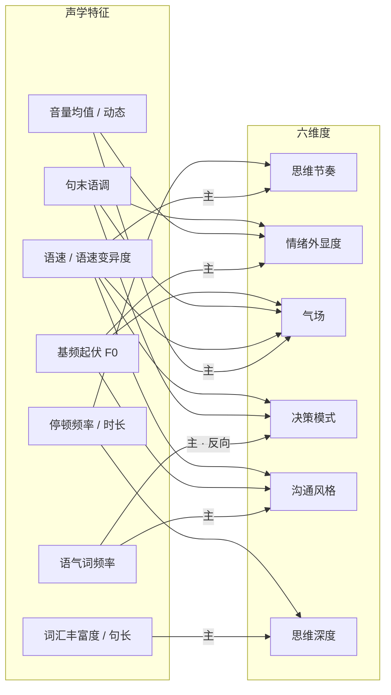
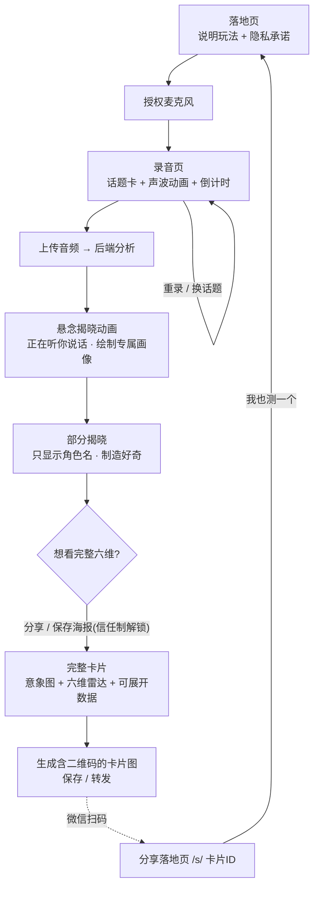
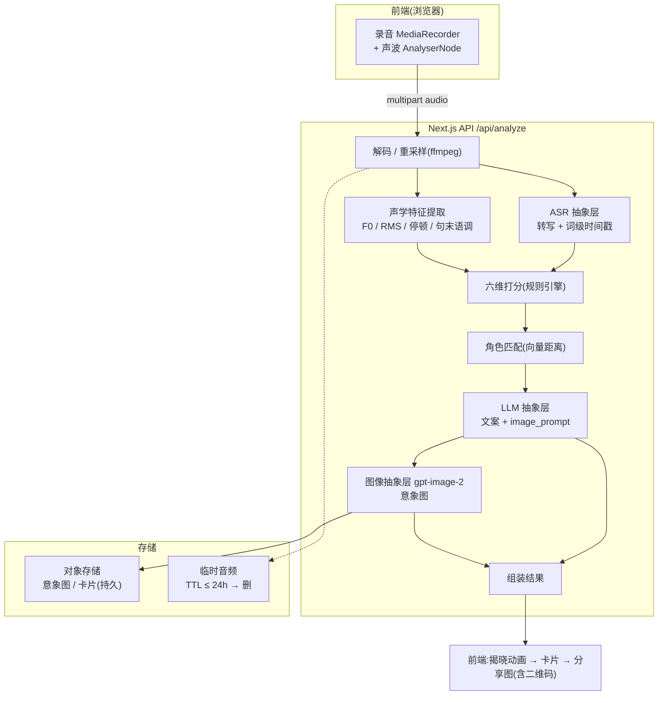
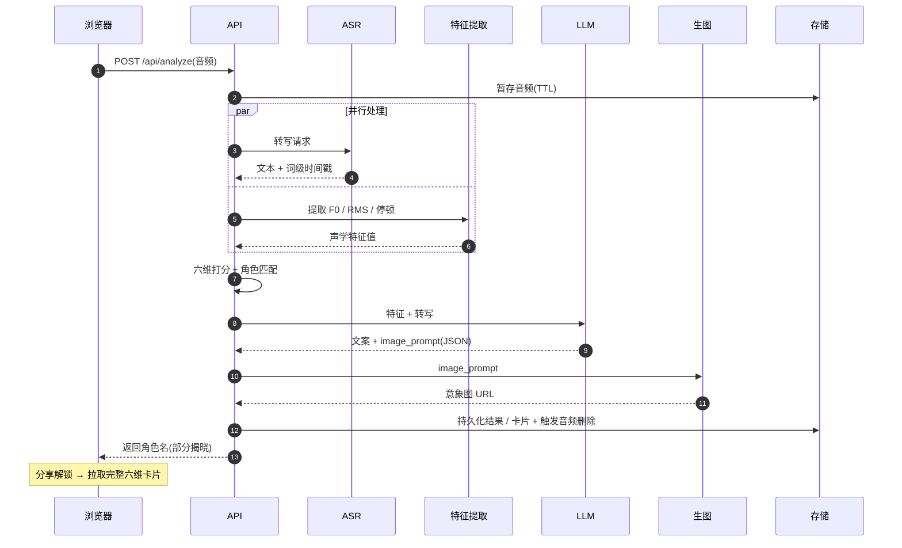
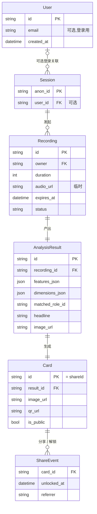
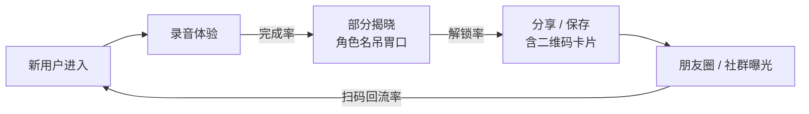

# EchoID 产品需求文档(PRD)

> 一句话定位:对着麦克风说 20–30 秒,EchoID 用真实声学特征为你画出一张"说话风格卡片",用角色比喻告诉你——你说话像谁。

| 项目 | 内容 |
|---|---|
| 产品名 | EchoID(Echo + Identity) |
| 文档版本 | v0.2(加入 Mermaid 图示) |
| 日期 | 2026-07-03 |
| 状态 | 需求已确认,待评审 |
| 形态 | Web 网页应用(移动端优先) |
| 调性 | 社交娱乐 / 分享裂变 |

---

## 1. 产品概述

### 1.1 背景与愿景
人们每天都在说话,却几乎从未"听见"自己是怎么说话的。EchoID 把语速、音调起伏、音量、停顿、语气词、句末语调等**真实可测的声学特征**,映射成六个易懂的风格维度,再用一个**角色比喻**(如"你说话像深夜电台主持人")和一张 AI 生成的意象图,让用户第一次直观"看见"自己的表达风格。

产品**不贴人格标签**(不做 MBTI/性格测试),只描述"你说话的样子"以及它给别人留下的印象。核心气质是**社交娱乐 + 值得晒**。

### 1.2 核心价值
- **自我觉察**:意识到自己平时怎么说话、给人什么印象。
- **社交货币**:一张好看、好玩、个性化的卡片,值得分享到朋友圈/社群。
- **可信的趣味**:比喻背后有真实声学数据支撑,可展开查看,"娱乐但不瞎说"。

### 1.3 非目标(Out of Scope)
- 不做人格/心理测评,不输出 MBTI 等标签。
- 不做语音教学、纠音、口才培训(v1)。
- 不做内容/观点分析,只分析"怎么说",不评判"说了什么对不对"。

---

## 2. 目标用户与场景

| 用户 | 场景 | 诉求 |
|---|---|---|
| 泛社交娱乐用户(18–35) | 刷到朋友分享的卡片,好奇自己是什么风格 | 快速、好玩、能晒 |
| 内容创作者 / 播客爱好者 | 想给"自己的声音人设"一个可视化标签 | 有个性、有梗、可传播 |
| 社群运营 / 团队破冰 | 群里一起测、互相调侃说话风格 | 低门槛、可对比、有话题 |

**关键场景**:用户在移动端浏览器打开链接 → 授权麦克风 → 就一个话题自由说 20–30 秒 → 悬念揭晓角色名 → 分享解锁完整六维卡片 → 保存/转发含二维码的卡片 → 好友扫码进来再测一个。

---

## 3. 核心模型:六维度 × 声学特征

这是产品的算法核心。所有可测声学特征先量化,再加权映射到六个用户可读维度。

### 3.1 可测量声学特征清单

| 特征 | 定义 | 来源 |
|---|---|---|
| 语速 SR | 字数 / 有效发声时长(字/秒),汉语常态 ≈ 4–6 | ASR 字数 + 时间戳 |
| 语速变异度 SR_var | 分段语速的标准差(节奏是否忽快忽慢) | ASR 分段 |
| 停顿数 pause_count | 静音段数量 | VAD / 能量阈值 |
| 平均停顿时长 pause_dur | 每次停顿平均秒数 | VAD |
| 停顿占比 pause_ratio | 静音时长 / 总时长 | VAD |
| 基频均值 F0_mean | 音高高低(嗓音基调) | Pitch(YIN/自相关) |
| 基频起伏 F0_std / F0_range | 音调起伏大小(情绪外显核心) | Pitch |
| 音量均值 RMS_mean | 说话强弱 | 能量 |
| 音量动态 RMS_dr | 音量的动态范围(抑扬) | 能量 |
| 句末语调 pitch_slope_end | 句尾 F0 上扬(疑问/不确定)或下降(肯定/果断) | Pitch + 分句 |
| 语气词频率 filler_rate | "嗯/啊/呃/那个/就是/然后"每分钟次数 | ASR 文本 |
| 词汇丰富度 TTR | 不同词数 / 总词数(type-token ratio) | ASR 文本 |
| 平均句长 sent_len | 平均每句字数 | ASR 文本 |

### 3.2 六维度映射规则

每个维度输出 **0–100 分 + 档位标签**;分数由相关特征加权归一化(基于人群基线校准),LLM 仅做语义润色与兜底判断,不主导打分。

| 维度 | 主要特征 | 解读方向 |
|---|---|---|
| **思维节奏** | 语速(主)、停顿频率、语速变异度 | 急风骤雨 ↔ 慢火细熬 |
| **情绪外显度** | F0 起伏(主)、音量动态、句末语调变化 | 起伏鲜明 ↔ 平稳内敛 |
| **气场** | 音量均值(主)、语速稳定性、句末下降比例、F0 基调 | 沉稳笃定 ↔ 轻盈随和 |
| **决策模式** | 语气词率(反向)、句末下降 vs 上扬、语速一致性 | 果断利落 ↔ 审慎斟酌 |
| **沟通风格** | 语气词频率、F0 热情度、语速 | 亲和健谈 ↔ 简洁克制 |
| **思维深度** | 词汇丰富度、句子复杂度、思考型停顿、信息密度 | 层层递进 ↔ 直给简明 |

下图为"声学特征 → 六维度"的映射关系,标 `主` 的边表示该维度的主导特征(权重最高):



> **冷启动基线**:v1 无用户数据,采用公开语音学经验区间设定初始基线;上线后按真实分布持续校准(埋点收集匿名特征分布)。

### 3.3 角色库设计

预设 **12–16 个角色**,每个角色定义:`id`、名称、一句话人设、**六维特征中心向量**(用于匹配)、意象图 prompt 模板、主题色。示例:

| 角色 | 典型声学画像 |
|---|---|
| 深夜电台主持人 | 慢语速 / 低音调 / 起伏小 / 停顿多 / 音量柔和 |
| 连珠炮讲师 | 极快 / 停顿少 / 音量高 / 中等起伏 |
| 邻家闲聊者 | 语速适中 / 语气词多 / 起伏大 / 亲和 |
| 沉稳决策者 | 语速稳 / 句末下降 / 填充词少 / 停顿有节奏 |
| 诗人朗读者 | 中慢速 / 起伏大 / 情感型停顿 |
| 脱口秀选手 | 快 / 节奏变化大 / 音量动态大 |
| 温柔树洞 | 慢 / 柔和 / 低音量 / 停顿多 |
| 会议室发言人 | 稳 / 中速 / 句末下降 / 信息密度高 |
| 好奇提问家 | 句末上扬多 / 中快 / 起伏大 |
| 深思哲学家 | 慢 / 多思考停顿 / 高词汇丰富度 / 低起伏 |
| 元气啦啦队 | 快 / 高音调 / 大起伏 / 大音量 |
| 冷静叙述者 | 匀速 / 起伏小 / 停顿规律 / 低填充 |

**匹配算法**:计算用户六维向量到各角色中心向量的加权距离(欧氏/余弦),取最近角色;LLM 在候选 Top-N 内做语义兜底与个性化文案。

---

## 4. 端到端用户流程



### 4.1 各环节 UX 要点

- **首屏**:先一屏说明玩法与隐私承诺("录音不保存/用完即删"),再进录音,降低麦克风授权顶屈。
- **录音页**:随机给一个开放话题(如"介绍一下你的周末");实时**声波/音量动画** + **倒计时** + **话题卡**,让用户知道"系统在听"、缓解尴尬。可换话题、可重录。
- **揭晓**:分析与 gpt-image-2 生图的等待时间(数十秒)**包装成揭晓悬念动画**,不做纯 loading;先给角色名吊胃口。
- **解锁**:分享/转发完整六维为**信任制**——点击分享或保存海报即解锁,不做真实验证(Web 难以验证)。
- **卡片**:上半屏 gpt-image-2 意象图为主视觉,下滑见六维雷达图,每维可展开查看真实声学数据(如"语速 4.2 字/秒")——满足好奇又不吓人。

---

## 5. 功能需求(Functional Requirements)

### FR-1 录音采集
- FR-1.1 使用 `getUserMedia` + `MediaRecorder` 采集音频(WebM/Opus)。
- FR-1.2 录音页显示话题卡、实时声波(Web Audio `AnalyserNode`)、倒计时。
- FR-1.3 支持重录、换话题;录音时长引导 20–30 秒(下限约 10s,上限约 45s)。
- FR-1.4 麦克风授权失败 / 不支持时给出降级提示(见风险:微信内置浏览器)。

### FR-2 上传与后端处理
- FR-2.1 前端将音频 `POST /api/analyze`(multipart)。
- FR-2.2 后端解码/重采样(ffmpeg),统一处理。
- FR-2.3 **声学特征提取**:F0/RMS/停顿/句末语调等(方案见 §6.3)。
- FR-2.4 **ASR 转写**:输出转写文本 + 词级时间戳,用于语速、停顿、语气词、词汇丰富度统计。
- FR-2.5 特征 → 六维打分(规则引擎)。

### FR-3 画像生成
- FR-3.1 角色匹配(向量距离,Top-N 候选)。
- FR-3.2 LLM(抽象层)生成:金句 headline、每维一句话解读、卡片文案、以及给 gpt-image-2 的最终 image prompt。
- FR-3.3 LLM 输出为**结构化 JSON**(Schema 约束,失败重试)。

### FR-4 意象图生成
- FR-4.1 调用 gpt-image-2(图像抽象层)按角色模板 + 个性化 prompt 生成意象图。
- FR-4.2 风格:**统一品牌基调 + 角色差异化**(基底一致,角色在色彩/元素上差异)。
- FR-4.3 生成结果存对象存储(持久,分享需要)。
- FR-4.4 生图延迟包装进揭晓动画;失败时回退到该角色预置意象图。

### FR-5 结果与卡片
- FR-5.1 部分揭晓 → 分享解锁 → 完整卡片(意象图 + 雷达图 + 可展开数据)。
- FR-5.2 服务端合成**卡片分享图**(意象图 + 角色名 + 金句 + **二维码**),二维码指向落地页 `/s/[cardId]`,微信扫码可跳转。
- FR-5.3 卡片图供下载/转发;同时提供分享链接。

### FR-6 分享落地页
- FR-6.1 `/s/[cardId]` 展示卡片(意象图 + 角色名 + 金句),含"我也测一个"入口。
- FR-6.2 落地页仅展示卡片结果,**不含原始音频**。
- FR-6.3 OG/微信分享 meta(标题、缩略图)配置,保证外链预览好看。

### FR-7 账号(匿名为主 + 可选登录)
- FR-7.1 默认匿名 session(cookie / anon id)即可完整体验。
- FR-7.2 可选登录:**Resend 邮箱验证码(OTP)** 登录,用于保存历史卡片。
- FR-7.3 登录后关联历史卡片(匿名 → 登录的数据合并)。

### FR-8 摄像头增强(可选,v1 非必须)
- FR-8.1 若用户授权摄像头,采集面部表情作**辅助参考**(情绪外显度维度加权微调)。
- FR-8.2 不授权也能得到完整画像;摄像头帧不落盘、仅本地/即时处理。
- FR-8.3 v1 可先占位设计,视排期决定是否进 v1。

---

## 6. 技术架构

### 6.1 技术栈
- **全栈**:Next.js(App Router)+ TypeScript,前后端一体。
- **前端音频**:Web Audio API(声波)、MediaRecorder(录音)。
- **卡片合成**:`@vercel/og` / `satori` 或服务端 canvas,叠加二维码(如 `qrcode`)。
- **存储**:结果/卡片/意象图持久化(Postgres + 对象存储如 S3/R2);原始音频临时存储带 TTL。
- **邮件**:Resend(OTP)。

### 6.2 管线架构



一次分析请求的调用顺序与并行关系(ASR 与声学特征提取并行,缩短总时延):



### 6.3 声学特征提取方案(关键技术决策)

Node/TS 生态的音频信号处理弱于 Python。三种方案权衡:

- **方案 A(MVP 推荐)**:ASR API(如 Whisper)拿转写+时间戳(算语速/停顿/语气词/TTR)+ 轻量 JS DSP(Meyda 算 RMS,自相关/YIN 算 F0)。零额外服务、够用。
- **方案 B(精度增强,v1.5+)**:挂一个 Python 微服务(FastAPI + `librosa`/`parselmouth`)做精确 F0/停顿/句末语调,Next.js 内部 HTTP 调用。精度最高。
- **方案 C**:多模态音频模型直出——放弃,声学数值不够硬、不可解释,与"可展开真实数据"诉求冲突。

> 决策:**v1 用方案 A**;若 F0/停顿精度不足以支撑六维区分度,升级到方案 B。

### 6.4 可替换抽象层(LLM / ASR / Image)
```ts
interface LLMProvider   { generateProfile(features, transcript): Promise<ProfileResult> }
interface ASRProvider   { transcribe(audio): Promise<{ text, wordTimestamps }> }
interface ImageProvider { generate(prompt): Promise<{ url }> }  // 默认 gpt-image-2
```
- 通过环境变量切换实现(Claude / OpenAI / 国内大模型 …),不绑定单一供应商。
- 图像默认 gpt-image-2,保留替换能力。

### 6.5 数据流与隐私
- **原始音频**:短期保留(建议 TTL ≤ 24h,便于重生成/排障)后自动删除;落地页与卡片**不含**原音。
- **转写文本**:仅用于生成"金句引用";可配置随音频一同过期。
- **卡片/意象图/六维结果**:持久化(分享需要)。
- 麦克风授权前明确告知隐私承诺,卡片上可标注"录音用完即删"增强信任。

---

## 7. 数据模型(概要)

| 实体 | 关键字段 |
|---|---|
| User | id, email?(可选登录), created_at |
| Session | anon_id / user_id |
| Recording | id, owner, duration, audio_url(临时), expires_at, status, created_at |
| AnalysisResult | id, recording_id, features_json, dimensions_json, matched_role_id, headline, card_copy, image_url, transcript?, created_at |
| Card | id(=shareId), result_id, image_url, qr_url, is_public, created_at |
| ShareEvent | card_id, unlocked_at, referrer |

实体关系如下:



---

## 8. 非功能需求

- **性能**:进入 → 出完整卡片目标 < 40s(含生图);声学分析+ASR 目标 < 8s。
- **兼容**:移动端主流浏览器优先;**微信内置浏览器 getUserMedia 受限**为已知风险(见 §10)。
- **隐私合规**:授权前说明、音频 TTL、支持删除;匿名可用,不强制收集个人信息。
- **可用性**:全流程移动端单手可完成;揭晓与等待有明确反馈,不出现无反馈 loading。
- **成本**:每次体验含 1 次 ASR + 1 次 LLM + 1 次 gpt-image-2,需监控单次成本;意象图失败回退预置图控成本。

---

## 9. 增长与埋点

- **北极星指标**:分享率(生成卡片并分享/保存的比例)。
- **关键指标**:完成率(进入→出卡片)、解锁率(部分揭晓→解锁)、扫码回流率、新用户来自分享占比、平均生成时长、意象图成功率。
- **裂变机制**:部分揭晓吊胃口 → 分享解锁 → 卡片含二维码 → 扫码回流闭环。

裂变闭环与关键指标(边上标注对应转化率):



---

## 10. 风险与待确认

| # | 风险 / 待确认 | 影响 | 应对 |
|---|---|---|---|
| R1 | **微信内置浏览器 getUserMedia 限制** | 录音可能无法在微信内直接进行 | 评估微信 JS-SDK 录音方案 / 引导"用浏览器打开";必须在开发前验证 |
| R2 | Node 声学特征精度 | 六维区分度不足 | 预留方案 B(Python 微服务)升级路径 |
| R3 | gpt-image-2 延迟/成本/稳定性 | 等待过长、成本高、抽象人像不稳定 | 揭晓动画掩盖延迟、失败回退预置图、prompt 模板收敛风格 |
| R4 | 信任制解锁的裂变效果 | 可能解锁率高但真实分享低 | 埋点观测,必要时 A/B 换"保存海报解锁" |
| R5 | 六维基线冷启动 | 打分偏差、人人相似 | 用语音学经验基线,上线后按真实分布校准 |
| R6 | 中文口语 ASR(口音/方言)准确率 | 语气词/TTR 统计失真 | 选中文表现好的 ASR;方言优化列入 v2 |

---

## 11. MVP 范围与迭代

### v1(MVP)
Web 录音(自由话题)、后端声学特征 + ASR、六维打分、角色库匹配、LLM 文案、gpt-image-2 意象图、悬念揭晓、分享解锁(信任制)、卡片图(含二维码)+ 落地页、匿名 + 可选 Resend 登录、音频短期后删。

### v2+
摄像头表情增强(若未进 v1)、历史卡片对比 / 成长曲线、更多角色、精确 Python 声学服务、方言优化、录音实时字幕、多语言。

---

## 12. 验收标准(节选)

- 用户可在移动端浏览器完成"授权→录音→揭晓→分享"全流程,无无反馈卡顿。
- 六维分数与真实声学特征一致(如语速快者"思维节奏"分高),数据可展开查看且与统计值吻合。
- 相同录音多次分析结果稳定(角色匹配一致性 ≥ 阈值)。
- 卡片分享图含可扫二维码,微信扫码能跳转对应落地页。
- 原始音频在 TTL 到期后确实删除(可验证)。
- 匿名可完整体验;Resend OTP 登录后历史卡片可见。

---

## 附录 A:LLM 结构化输出 Schema(草案)
```json
{
  "matched_role_id": "late_night_radio_host",
  "role_title": "深夜电台主持人",
  "headline": "你说话像深夜电台主持人",
  "dimensions": [
    { "key": "thinking_tempo", "score": 32, "level_label": "慢火细熬",
      "one_liner": "你不赶时间,让每句话都落稳", "evidence_metric": "语速 3.6 字/秒" }
  ],
  "card_copy": "……",
  "image_prompt": "……(基于角色模板 + 个性化,交给 gpt-image-2)"
}
```
